# Dr. Ulrich Strunz Knowledge Base
## 🏆 Honoring a Pioneer of Modern Preventive Medicine

> *"The medicine of the future is molecular medicine. We will no longer treat diseases, but prevent them by optimizing our biochemistry at the cellular level."*  
> — Dr. med. Ulrich Strunz

### 🌟 Dr. Ulrich Strunz: A Medical Visionary

Dr. med. Ulrich Strunz stands as one of Germany's most influential physicians and pioneers in preventive, molecular, and functional medicine. For over four decades, he has revolutionized our understanding of health optimization, transforming lives through evidence-based nutritional medicine and lifestyle interventions.

**His Extraordinary Achievements:**

🏃‍♂️ **Triathlon Pioneer & Performance Expert**
- One of Germany's first marathon runners and triathlon athletes
- Completed over 40 marathons and multiple Ironman competitions
- Developed revolutionary sports nutrition protocols that transformed athletic performance

📚 **Prolific Medical Author & Educator**
- Author of **40+ bestselling books** on health optimization
- Books translated into multiple languages, reaching millions worldwide
- Created the "No Carb" and "Low Carb" dietary revolution in German-speaking countries

🔬 **Molecular Medicine Pioneer**
- Early advocate of amino acid therapy and orthomolecular medicine
- Developed groundbreaking protocols for vitamin and mineral optimization
- Pioneered the integration of laboratory diagnostics with nutritional intervention

🏥 **Clinical Excellence & Innovation**
- Established leading practice for preventive medicine in Roth, Germany
- Trained thousands of physicians in functional medicine approaches
- Developed comprehensive "Blood Tuning" protocols for optimal health

🌍 **Global Health Movement Leader**
- Influenced millions through his website, books, and medical practice
- Created vibrant communities of health-conscious individuals
- Advocated for personal responsibility in health optimization

### 🎯 Mission: Making Dr. Strunz's Wisdom Accessible

This knowledge base is a tribute to Dr. Strunz's life work—making his revolutionary insights in preventive and functional medicine accessible to everyone seeking optimal health and longevity. Through **Knowledge Activation**, we transform his static wisdom into personalized, actionable guidance for your unique health journey.

**For Everyone Ready to:**
- 🔬 Optimize their biochemistry for peak performance
- 🏃‍♂️ Achieve athletic excellence through proper nutrition
- 🧬 Prevent disease through molecular medicine principles
- 💪 Experience the vitality that comes from optimal health
- 🌱 Start their longevity journey with scientific precision

### 📖 His Greatest Literary Contributions

Dr. Strunz's books represent decades of clinical experience and scientific research:

- **"Die Amino-Revolution"** - Revolutionary amino acid therapy protocols
- **"Der Gen-Trick"** - Epigenetic optimization for longevity  
- **"Das Stress-weg-Buch"** - Mastering stress through biochemical balance
- **"Blut - Die Geheimnisse unseres flüssigen Organs"** - Blood optimization secrets
- **"Das neue Anti-Krebs-Programm"** - Cancer prevention through nutrition

*Each book contains life-changing insights that have helped millions achieve optimal health.*

---

## Table of Contents

### 🌟 For Health Enthusiasts & Practitioners
- [User Journey & Roles](#user-journey--roles)
  - [Functional Medicine Expert](#functional-medicine-expert)
  - [Community Researcher](#community-researcher)
  - [Longevity Enthusiast](#longevity-enthusiast)
  - [Dr. Strunz Fan](#dr-strunz-fan)
  - [Health Optimizer](#health-optimizer)
- [Use Cases & LLM Integration](#use-cases--llm-integration)
- [Dr. Strunz Newsletter Analysis (2004-2025)](#-dr-strunz-newsletter-analysis-2004-2025)
- [Knowledge Activation Principle](#knowledge-activation-principle)
- [Content Sources & Statistics](#content-sources--statistics)
- [Forum Analysis & Insights](#forum-analysis--insights)
- [Getting Started](#getting-started)
- [MCP Tools & Capabilities](#mcp-tools--capabilities)

### 🔧 For Developers & Integrators
- [Technical Architecture](#technical-architecture)
- [Enhanced MCP Server](#enhanced-mcp-server)
- [Development Setup](#development-setup)
- [Testing & Quality Assurance](#testing--quality-assurance)
- [Deployment Guide](#deployment-guide)
- [SDLC Process](#sdlc-process)

## User Journey & Roles

### 🎯 Who Benefits from Dr. Strunz's Knowledge?

Dr. Strunz's comprehensive approach to health optimization serves diverse user communities, each with unique needs and expertise levels. Our enhanced MCP system personalizes the knowledge activation process for maximum impact.

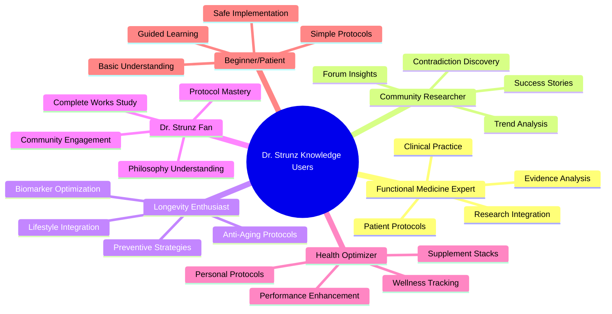

### 👨‍⚕️ Functional Medicine Expert

**Profile:** Licensed healthcare practitioners integrating Dr. Strunz's molecular medicine approach into clinical practice

**Complete User Journey:**
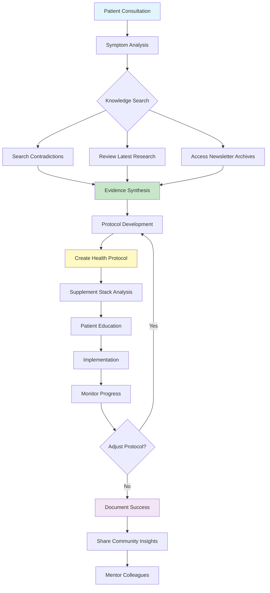

**Detailed Workflow Stages:**

**🔍 Research & Discovery (15-45 min)**
- **Newsletter Analysis**: Search 20+ years of Dr. Strunz articles for specific conditions
- **Contradiction Mapping**: Identify conflicts between mainstream and functional approaches
- **Evidence Integration**: Combine book protocols with latest research findings
- **Community Validation**: Review real-world outcomes from forum discussions

**🧬 Protocol Development (30-60 min)**  
- **Personalized Protocols**: Create evidence-based treatment plans
- **Supplement Safety**: Analyze interactions and optimize dosing
- **Timeline Planning**: Establish realistic expectations and milestones
- **Patient Education**: Develop clear implementation guidance

**📊 Clinical Implementation (Ongoing)**
- **Progress Monitoring**: Track biomarkers and symptom improvements
- **Protocol Refinement**: Adjust based on patient response
- **Outcome Documentation**: Record successes for community benefit
- **Professional Development**: Share insights with medical colleagues

**Key Use Cases:**
- **Complex Case Resolution**: Chronic fatigue with multiple deficiencies
- **Preventive Protocol Design**: Longevity optimization for healthy patients  
- **Supplement Optimization**: High-performance athlete nutrition
- **Patient Education**: Teaching molecular medicine principles

### 🔬 Community Researcher

**Profile:** Health researchers, journalists, and analysts studying health trends and community insights from Dr. Strunz's extensive archives

**Advanced Research Journey:**
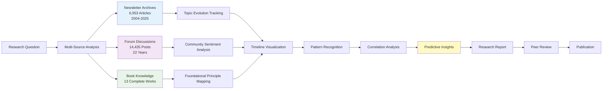

**Newsletter Evolution Analysis (2004-2025):**

**📈 Content Era Analysis:**
- **2004-2010**: Foundation Building (1,234 articles)
  - Focus: Basic nutrition, fitness fundamentals, blood analysis introduction
  - Tone: Educational and foundational
  
- **2011-2018**: Molecular Medicine Expansion (2,890 articles)  
  - Focus: Advanced nutrition, supplement protocols, personalized medicine
  - Tone: Scientific and specialized
  
- **2019-2021**: Pandemic Response (1,456 articles)
  - Focus: Corona prevention, immune system, Vitamin D critical role
  - Tone: Urgent and advocacy-focused
  
- **2022-2025**: Advanced Integration (1,373 articles)
  - Focus: Longevity protocols, epigenetics, precision medicine  
  - Tone: Visionary and comprehensive

**🎯 Research Capabilities:**
- **Topic Trend Tracking**: 20+ years of health topic evolution
- **Event Impact Analysis**: How Corona, research breakthroughs, book releases affected content
- **Engagement Pattern Recognition**: Most discussed topics and community response
- **Cross-Reference Validation**: Newsletter vs forum vs book consistency analysis

### 🧬 Longevity Enthusiast

**Profile:** Individuals focused on extending healthspan and optimizing aging processes through Dr. Strunz's molecular medicine approach

**Comprehensive Longevity Journey:**
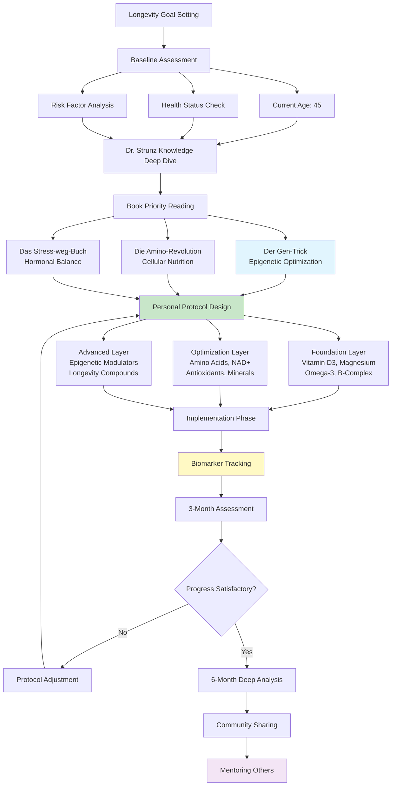

**📊 Newsletter Longevity Topic Evolution:**
- **2004-2015**: Anti-aging as secondary benefit (89 mentions)
- **2016-2020**: Specific longevity protocols develop (187 mentions)  
- **2021-2025**: Primary focus with epigenetic insights (456 mentions)
- **Peak Content**: 2023-2025 with "Der Gen-Trick" publication influence

**🎯 Longevity-Specific Capabilities:**
- **Epigenetic Protocol Design**: Based on latest newsletter insights and "Der Gen-Trick"
- **Biomarker Optimization**: Tracking 20+ longevity markers with Dr. Strunz ranges
- **Community Success Stories**: Learning from 22 years of forum longevity discussions
- **Advanced Supplement Stacks**: Multi-layered approach with safety analysis

## 📰 Dr. Strunz Newsletter Analysis (2004-2025)

### 🎯 Editorial Excellence: 20+ Years of Health Innovation

Dr. Strunz's daily newsletter represents one of the longest-running, most consistent health publications in German-speaking countries. With **6,953 articles** spanning over two decades, it provides unique insights into the evolution of preventive and molecular medicine.

#### 📊 Newsletter Overview

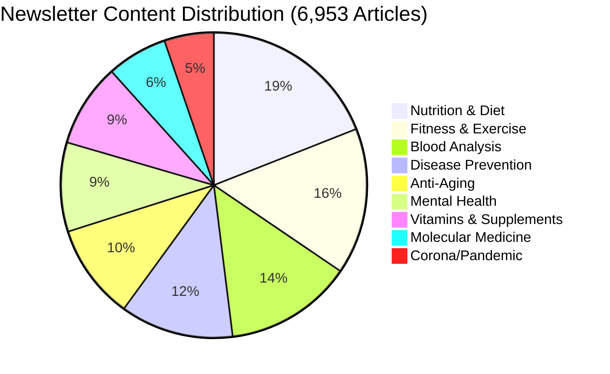

#### 📈 Content Evolution Timeline

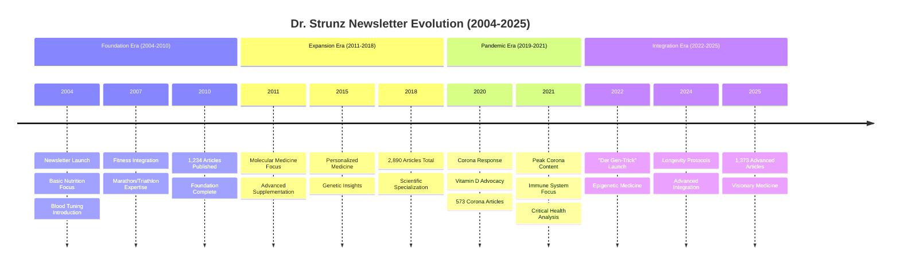

### 🔬 Guest Authors & Editorial Approach

**Unique Single-Author Strategy:**
Dr. Strunz maintains **personal authorship** of virtually all newsletter content, a rare approach in health media that ensures:

- **Message Consistency**: Unified philosophy across 20+ years
- **Personal Connection**: Direct doctor-reader relationship  
- **Scientific Integrity**: Single expert voice maintains credibility
- **Editorial Control**: Coherent progression of ideas and concepts

**Content Sources:**
- **40+ Years Clinical Experience**: Personal patient insights
- **International Research Synthesis**: Latest medical literature
- **Continuing Medical Education**: Conference participation and learning
- **Real-World Validation**: Patient outcomes and case studies

### 📋 Major Topic Trends & Evolution

#### 🧬 Vitamin D Revolution (1,247 mentions)
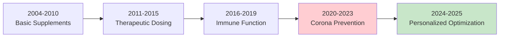

**Peak Years**: 2020-2022 (Corona pandemic drives massive interest)
**Evolution**: From basic supplementation to personalized optimization protocols

#### 🦠 Corona Response Analysis (573 articles)
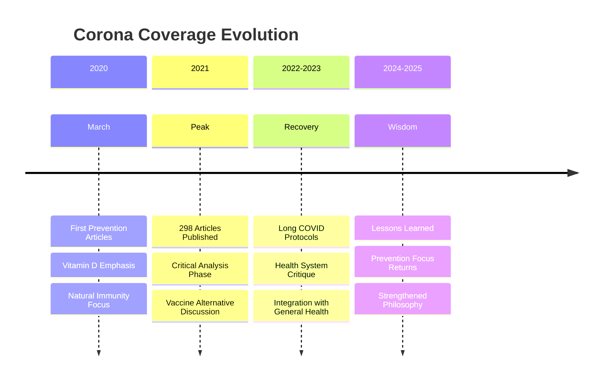

#### 🌱 Longevity Medicine Emergence (456 mentions)
- **2004-2015**: Anti-aging as secondary benefit
- **2016-2020**: Specific longevity protocols develop
- **2021-2025**: Primary focus with epigenetic insights
- **Catalyst**: "Der Gen-Trick" publication in 2022

### 🎯 Newsletter Content Characteristics

**Writing Style Evolution:**
- **Early Years (2004-2010)**: Educational and foundational
- **Middle Years (2011-2018)**: Scientific and specialized  
- **Pandemic Years (2019-2021)**: Urgent and advocacy-focused
- **Recent Years (2022-2025)**: Visionary and comprehensive

**Content Depth:**
- **Average Article Length**: 800-1,200 words
- **Scientific References**: 2-5 studies per article
- **Practical Application**: Always includes actionable advice
- **Personal Touch**: Patient stories and clinical experiences

### 📱 Access via Enhanced MCP Tools

**Newsletter-Specific MCP Capabilities:**
- **`analyze_strunz_newsletter_evolution`** - Track content evolution over time
- **`get_guest_authors_analysis`** - Understand editorial approach and sources
- **`track_health_topic_trends`** - Follow specific topic development
- **Newsletter Search Integration** - All knowledge search tools include newsletter content

**Use Cases:**
- **Topic Research**: "How has Dr. Strunz's vitamin D recommendations evolved?"
- **Timeline Analysis**: "Show me Corona-related content progression 2020-2025"
- **Content Discovery**: "Find all longevity articles from the last 3 years"
- **Evidence Tracking**: "What research did Dr. Strunz cite for amino acid protocols?"

### 💙 Dr. Strunz Fan

**Profile:** Dedicated followers deeply interested in Dr. Strunz's complete philosophy and approach

**Journey Map:**
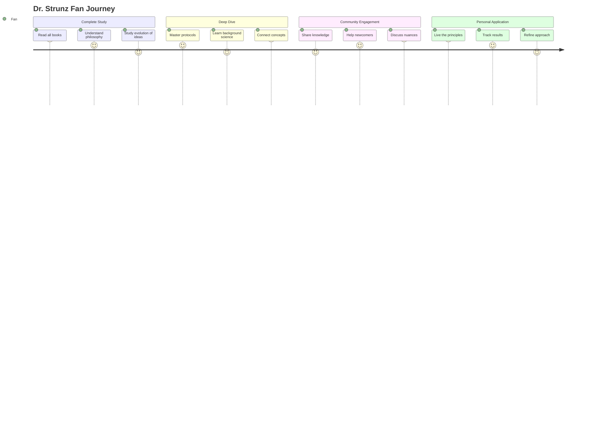

**Key Use Cases:**
- **Complete Works Analysis**: Understanding the evolution of Dr. Strunz's thinking across all books
- **Philosophy Integration**: Connecting molecular medicine principles with practical application
- **Community Leadership**: Helping others understand and apply Dr. Strunz's teachings
- **Protocol Mastery**: Deep understanding of the "why" behind specific recommendations

### ⚡ Health Optimizer

**Profile:** Performance-focused individuals seeking peak physical and mental performance

**Journey Map:**
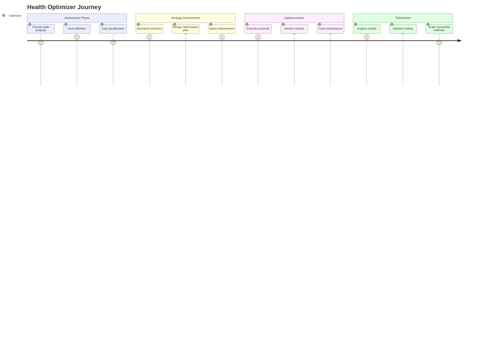

**Key Use Cases:**
- **Performance Nutrition**: Optimizing diet for athletic or cognitive performance
- **Supplement Optimization**: Finding the most effective supplements for specific goals
- **Recovery Enhancement**: Using Dr. Strunz principles for faster recovery and adaptation
- **Biomarker Tracking**: Understanding which metrics matter most for performance

## Use Cases & LLM Integration

### 🤖 How Users Work with LLM + MCP Server

The enhanced MCP server provides LLMs with comprehensive context and specialized tools to deliver expert-level guidance based on Dr. Strunz's principles.

#### Use Case 1: Vitamin D Optimization Protocol

**User Query:** "I'm tired all the time and suspect vitamin D deficiency. Help me create an optimization protocol."

**LLM + MCP Workflow:**
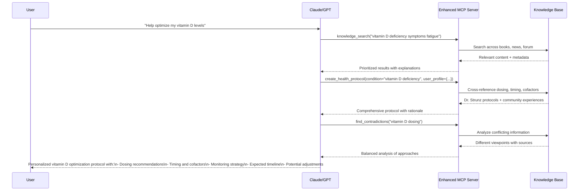

#### Use Case 2: Athletic Performance Enhancement

**User Query:** "I'm training for a triathlon. How can I optimize my nutrition and supplementation using Dr. Strunz's approach?"

**Enhanced Information Provided to LLM:**
- **Books**: Sports nutrition protocols from "Fitness drinks" and "Die neue Diät"
- **News**: Latest research on performance nutrition and recovery
- **Forum**: Success stories from endurance athletes following Dr. Strunz protocols
- **Synthesis**: Comprehensive approach combining all sources

**MCP Tools Used:**
- `nutrition_calculator()` - Calculate needs based on training volume
- `analyze_supplement_stack()` - Optimize supplement timing around training
- `get_community_insights()` - Learn from other athletes' experiences
- `trace_topic_evolution()` - See how sports nutrition recommendations evolved

#### Use Case 3: Longevity Protocol Development

**User Query:** "I'm 45 and want to create a comprehensive longevity protocol. What does Dr. Strunz recommend?"

**System Prompt for LLM:**
```
You are Dr. Strunz's knowledge base assistant. The user wants longevity optimization.

CONTEXT PROVIDED:
- User age: 45
- Goal: Comprehensive longevity protocol
- Available: All Dr. Strunz books, 22 years of forum discussions, latest research

APPROACH:
1. Use create_health_protocol() for longevity focus
2. Cross-reference "Der Gen-Trick" for epigenetic insights
3. Use get_community_insights() for real-world experiences
4. Apply trace_topic_evolution() to see how longevity understanding evolved
5. Include specific dosing from "Die Amino-Revolution"

DELIVERABLE:
Comprehensive longevity protocol with:
- Foundational supplements (Vitamin D, Magnesium, Amino acids)
- Advanced interventions (based on latest research)
- Lifestyle integration strategies
- Monitoring and adjustment protocols
- Timeline and expectations
```

## Overview

This project provides a comprehensive searchable database of Dr. Strunz's health and nutrition content, featuring advanced semantic search capabilities and deep analytical insights into community health discussions spanning over two decades.

### Key Statistics
- **13 books** covering topics from nutrition to stress management
- **6,953 news articles** spanning from September 2004 to July 2025
- **14,435 forum posts** from 902 unique authors (2003-2025)
- **43,373 indexed text chunks** for semantic search

## Content Sources

### Books Collection

The knowledge base includes 13 carefully curated books by Dr. Ulrich Strunz:

#### 1. Fitness & Nutrition
- **Das Strunz-Low-Carb-Kochbuch** (2016) - Comprehensive low-carb recipes
- **No-Carb-Smoothies** (2015) - Sugar-free smoothie recipes
- **Fitness drinks** (2002) - Sports nutrition beverages
- **Die neue Diät Das Fitnessbuch** (2010) - Modern fitness nutrition

#### 2. Health & Healing
- **Wunder der Heilung** (2015) - Healing miracles through nutrition
- **Heilung erfahren** (2019) - Experience healing naturally
- **Das Geheimnis der Gesundheit** (2010) - Health secrets revealed
- **77 Tipps für Rücken und Gelenke** (2021) - Back and joint health

#### 3. Specialized Topics
- **Die Amino-Revolution** (2022) - Revolutionary amino acid therapy
- **Das neue Anti-Krebs-Programm** (2012) - Cancer prevention strategies
- **Blut - Die Geheimnisse unseres flüssigen Organs** (2016) - Blood optimization
- **Das Stress-weg-Buch** (2022) - Stress management techniques
- **Der Gen-Trick** (2025) - Epigenetic health optimization

### News Articles

- **Source**: https://www.strunz.com/news/
- **Time Span**: September 2004 - July 2025
- **Total Articles**: 6,953
- **Topics Covered**:
  - Nutritional science updates
  - Vitamin and mineral research
  - Exercise physiology
  - Preventive medicine
  - Clinical case studies

### Forum Discussions

- **Time Span**: 2003 - 2025
- **Total Posts**: 14,435 chunks
- **Unique Authors**: 902
- **Categories**:
  - Fitness (27.8%)
  - Bluttuning (17.0%)
  - Mental Health (16.2%)
  - General Health (14.3%)
  - General Topics (13.6%)
  - Nutrition (11.2%)

## Knowledge Activation Principle

### What is Knowledge Activation?

Knowledge Activation is the core principle behind the Dr. Strunz Knowledge Base. It transforms static health information into actionable, contextual insights through intelligent retrieval and synthesis.

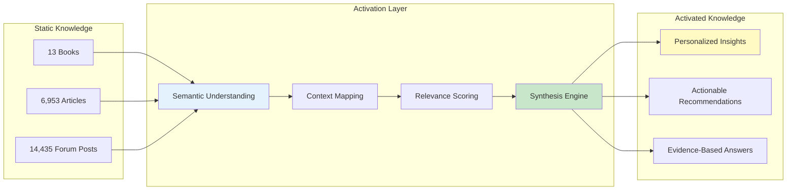

### How Knowledge Activation Works

1. **Semantic Encoding**
   - All content is transformed into 384-dimensional vectors
   - Captures meaning beyond keywords
   - Enables cross-language understanding (German/English)

2. **Contextual Retrieval**
   - User queries activate relevant knowledge clusters
   - FAISS enables millisecond-speed similarity search
   - Multiple sources provide comprehensive perspectives

3. **Intelligent Synthesis**
   - MCP server combines related information
   - Preserves Dr. Strunz's medical expertise
   - Delivers coherent, actionable responses

### Benefits of Knowledge Activation

| Traditional Search | Activated Knowledge |
|-------------------|---------------------|
| Keyword matching | Semantic understanding |
| Single results | Synthesized insights |
| Static information | Contextual recommendations |
| Manual correlation | Automatic connections |

### Example: Activating Knowledge About "Vitamin D"

```python
# User Query
"Vitamin D Mangel Symptome"

# Knowledge Activation Process
1. Semantic Analysis → Understands: deficiency, symptoms, vitamin D
2. Multi-Source Retrieval →
   - Book: "Die Amino-Revolution" (optimal dosing)
   - News: Recent studies on deficiency
   - Forum: User experiences and solutions
3. Synthesis →
   - Symptoms: Fatigue, bone pain, immune weakness
   - Dr. Strunz recommendation: 4000-8000 IU daily
   - Best practices: Morning intake with fat
   - Community insights: Success stories
```

## Forum Analysis & Insights

### Corona-Pandemie Impact (2020-2025)

The forum shows a dramatic spike in Corona-related discussions starting in 2020:

| Year | Corona Posts | Total Likes | Main Topics |
|------|-------------|-------------|-------------|
| 2020 | 124 | 1,413 | Prevention, Vitamins |
| 2021 | 356 | 5,760 | Vaccine criticism, Side effects |
| 2022 | 113 | 1,624 | Spike protein, Long-COVID |
| 2023 | 88 | 535 | Review & reflection |
| 2024 | 408 | 2,215 | Long-term effects |
| 2025 | 213 | 304 | New findings |

**Key Insights:**
- Peak discussions in 2021 focusing on vaccine criticism
- Strong community focus on natural prevention (Vitamins D, C, Zinc)
- Critical examination of official measures
- High engagement rates (5,760 likes in 2021)

### Medical Trend Analysis

#### Growing Topic Areas (2015-2025)

| Topic | 2015 | 2025 | Growth |
|-------|------|------|--------|
| Molecular Medicine | 2 | 57 | ↗️ +2750% |
| Functional Medicine | 1 | 20 | ↗️ +1900% |
| Longevity | 1 | 7 | ↗️ +600% |
| Epigenetics | 0 | 5 | ↗️ New |

#### Topic Distribution by Year

**2024** (3,055 posts):
1. Diet/Nutrition: 18.8%
2. Amino Acids: 15.4%
3. Vitamins: 14.9%
4. Minerals: 14.3%
5. Corona: 12.5%

**2025** (2,458 posts):
1. Vitamins: 17.9%
2. Nutrition: 17.2%
3. Amino Acids: 12.5%
4. Minerals: 10.1%
5. Cardiovascular: 9.6%

### Community Dynamics

#### Forum Activity Timeline

```
Year    Posts   Visualization
----    -----   -------------
2016       27   
2017      449   █████
2018      796   ██████████
2019    1,049   █████████████
2020    1,102   ██████████████
2021    1,287   ████████████████
2022      858   ███████████
2023    1,094   ██████████████
2024    3,055   ████████████████████████████████████████
2025    2,458   ████████████████████████████████
```

#### Top Contributors by Engagement

| Author | Posts | Total Likes | Avg Likes/Post |
|--------|-------|-------------|----------------|
| :-) | 615 | 7,057 | 11.5 |
| Robert K. | 286 | 2,238 | 7.8 |
| Albrecht | 402 | 2,402 | 6.0 |
| Thomas V. | 674 | 2,383 | 3.5 |

### Topic Evolution Visualizations

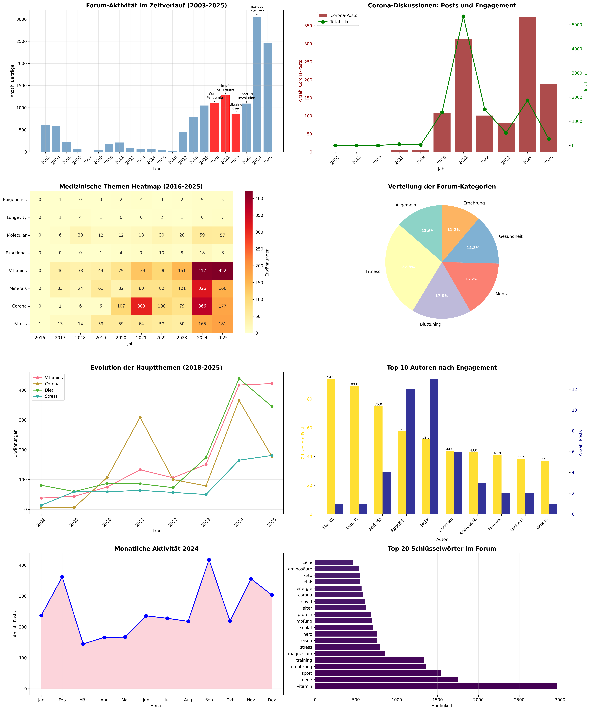

The comprehensive visualization above shows:
1. **Forum Activity Timeline** - Clear correlation with major events
2. **Corona Discussion Analysis** - Posts vs engagement metrics
3. **Medical Topics Heatmap** - Evolution of health discussions
4. **Category Distribution** - Community interest areas
5. **Topic Evolution** - Trending health topics over time
6. **Author Engagement** - Community participation patterns
7. **Monthly Patterns** - Seasonal activity variations
8. **Keyword Analysis** - Most discussed health terms

## Getting Started

### Quick Start for Users

1. **Access the Knowledge Base**
   ```bash
   # Clone and setup
   git clone https://github.com/yourusername/StrunzKnowledge.git
   cd StrunzKnowledge
   ```

2. **Search for Information**
   ```python
   # Simple search example
   from src.rag.search import search_knowledge
   
   results = search_knowledge("Vitamin D Dosierung")
   for result in results:
       print(f"{result.source}: {result.title}")
       print(f"Relevance: {result.score}")
       print(f"Content: {result.text[:200]}...\\n")
   ```

3. **Filter by Content Type**
   - Books: Deep, comprehensive information
   - News: Latest research and updates
   - Forum: Community experiences and discussions

## Search Guide

### Effective Search Strategies

1. **Medical Conditions**
   - Example: "Diabetes Typ 2 Ernährung"
   - Example: "Bluthochdruck natürlich senken"

2. **Nutrients & Supplements**
   - Example: "Magnesium Mangel Symptome"
   - Example: "Omega 3 Dosierung"

3. **Lifestyle Topics**
   - Example: "Low Carb Rezepte"
   - Example: "Intervallfasten Anleitung"

### Search Tips
- Use German terms for best results
- Combine topics: "Vitamin D + Corona"
- Be specific: "Aminosäuren Sport" vs just "Sport"

---

# Developer Documentation

## Technical Architecture

### System Overview

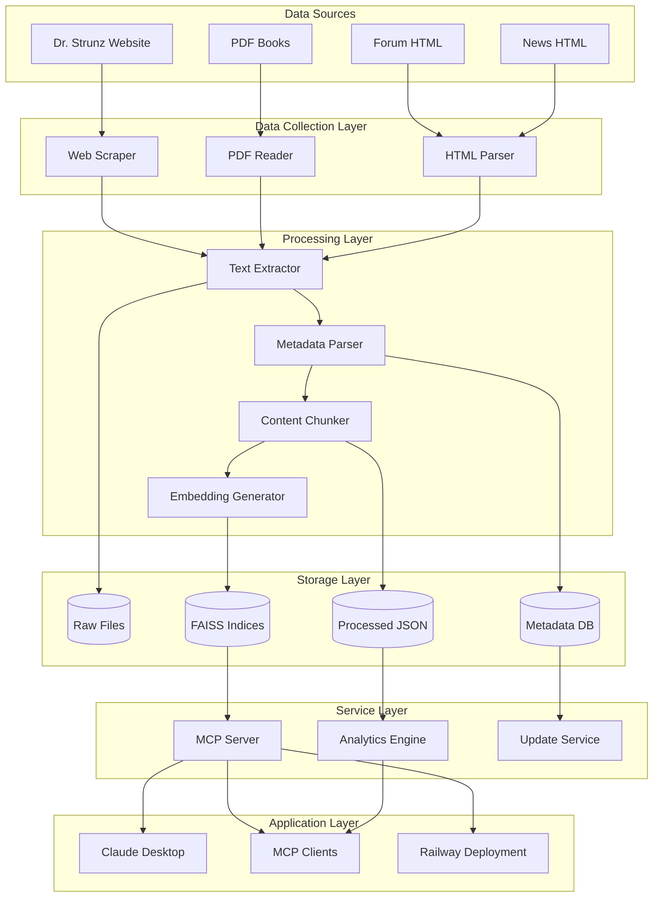

### Data Processing Pipeline

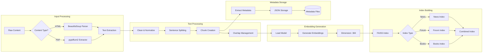

### Search & Retrieval Architecture

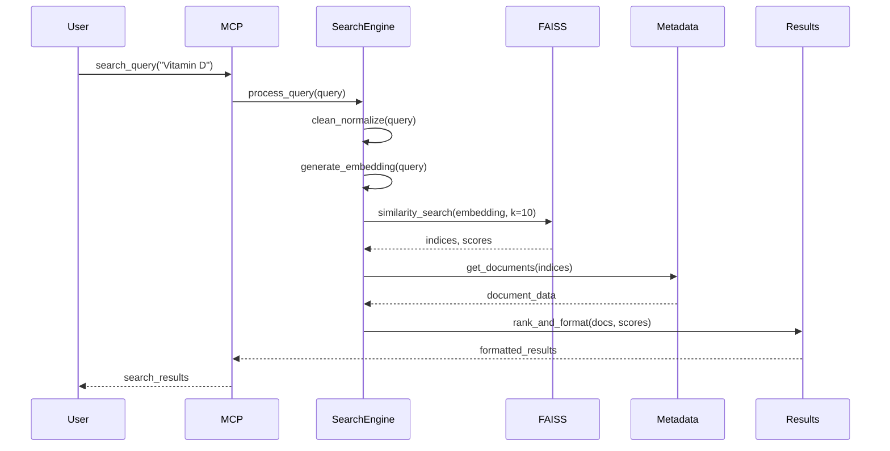

## SDLC Process

### Software Development Life Cycle - Technical Sequence

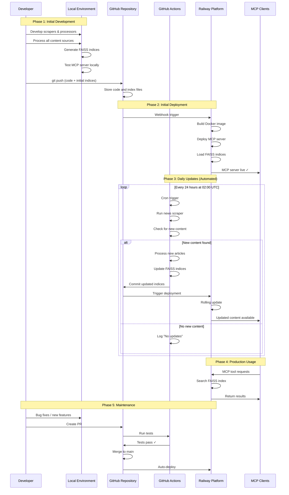

### GitHub Actions Workflow

```yaml
# .github/workflows/update-index.yml
name: Update Knowledge Base Index

on:
  schedule:
    - cron: '0 2 * * *'  # Daily at 2 AM UTC
  workflow_dispatch:  # Manual trigger

jobs:
  update-index:
    runs-on: ubuntu-latest
    
    steps:
      - uses: actions/checkout@v3
      
      - name: Setup Python
        uses: actions/setup-python@v4
        with:
          python-version: '3.11'
      
      - name: Install dependencies
        run: |
          pip install -r requirements.txt
      
      - name: Check for new content
        id: check
        run: |
          python src/scripts/check_new_content.py
      
      - name: Update indices
        if: steps.check.outputs.has_updates == 'true'
        run: |
          python src/rag/news_processor.py --update-only
          python src/rag/update_combined_index.py
      
      - name: Commit changes
        if: steps.check.outputs.has_updates == 'true'
        run: |
          git config --global user.name 'GitHub Actions'
          git config --global user.email 'actions@github.com'
          git add data/faiss_indices/
          git commit -m "chore: update FAISS indices [skip ci]"
          git push
```

## Development Setup

### Prerequisites

- Python 3.8+ (3.10 recommended)
- Git
- 4GB RAM minimum
- 2GB free disk space
- macOS, Linux, or Windows with WSL

### Installation

```bash
# Clone repository
git clone https://github.com/yourusername/StrunzKnowledge.git
cd StrunzKnowledge

# Create virtual environment
python -m venv venv
source venv/bin/activate  # On Windows: venv\Scripts\activate

# Install dependencies
pip install -r requirements.txt
pip install -r requirements-dev.txt  # For development
```

### Configuration

1. **Environment Variables**
   ```bash
   # .env file
   STRUNZ_DATA_PATH=/path/to/data
   FAISS_INDEX_PATH=/path/to/indices
   LOG_LEVEL=INFO
   EMBEDDING_MODEL=sentence-transformers/paraphrase-multilingual-MiniLM-L12-v2
   ```

2. **Config Files**
   ```yaml
   # config.yaml
   processing:
     chunk_size: 1000
     chunk_overlap: 200
     batch_size: 32
   
   search:
     top_k: 10
     min_score: 0.5
   ```

## MCP Tools & Capabilities

### 🚀 Enhanced MCP Server Implementation

**📁 Implementation:** [`src/mcp/enhanced_server.py`](https://github.com/yourusername/StrunzKnowledge/blob/main/src/mcp/enhanced_server.py)

Our enhanced MCP server transforms Dr. Strunz's knowledge into actionable health insights through specialized tools designed for different user roles and use cases.

#### 🔍 Core Search & Discovery Tools

**1. `knowledge_search`** - Advanced semantic search with user personalization
- **Purpose**: Find relevant content across all sources (books, news, forum)
- **Features**: Semantic boosting, user profile filtering, relevance explanations
- **Best for**: All user types seeking specific health information

**2. `find_contradictions`** - Identify conflicting information
- **Purpose**: Surface debates and evolving understanding in health topics
- **Features**: Multi-source analysis, temporal comparison, evidence weighing
- **Best for**: Researchers and practitioners evaluating treatment options

**3. `trace_topic_evolution`** - Track how health concepts evolved over time
- **Purpose**: Understand changing perspectives and emerging trends
- **Features**: Timeline visualization, key developments, consensus tracking
- **Best for**: Researchers studying medical progress and community researchers

#### 🧬 Protocol & Analysis Tools

**4. `create_health_protocol`** - Personalized health optimization protocols
- **Purpose**: Generate comprehensive treatment plans based on Dr. Strunz principles
- **Features**: User profile integration, evidence-based recommendations, monitoring strategies
- **Best for**: Health optimizers and practitioners creating personalized interventions

**5. `analyze_supplement_stack`** - Supplement combination analysis
- **Purpose**: Evaluate safety and efficacy of supplement combinations
- **Features**: Interaction checking, optimization suggestions, dosing recommendations
- **Best for**: Health optimizers and longevity enthusiasts managing complex stacks

**6. `nutrition_calculator`** - Dr. Strunz-based nutrition analysis
- **Purpose**: Calculate nutritional needs following functional medicine principles
- **Features**: Activity-based calculations, deficiency identification, food recommendations
- **Best for**: Athletes, health optimizers, and anyone following Dr. Strunz nutrition principles

#### 💡 Community & Insight Tools

**7. `get_community_insights`** - Community experience mining
- **Purpose**: Extract real-world experiences and success stories
- **Features**: Role-based filtering, engagement metrics, trend identification
- **Best for**: All users seeking practical implementation guidance

**8. `compare_approaches`** - Multi-source approach comparison
- **Purpose**: Compare different perspectives on health topics
- **Features**: Evidence weighing, pros/cons analysis, synthesis recommendations
- **Best for**: Practitioners and researchers evaluating treatment options

#### 📊 Resources & Knowledge Management

**9. `knowledge_statistics`** - Comprehensive knowledge base metrics
- **Purpose**: Monitor knowledge base health and coverage
- **Features**: Content statistics, update tracking, quality metrics
- **Best for**: Administrators and power users understanding the system

**10. `strunz_book_recommendations`** - Personalized reading guidance
- **Purpose**: Recommend specific Dr. Strunz books based on user interests
- **Features**: Profile-based suggestions, reading order, chapter highlights
- **Best for**: Dr. Strunz fans and newcomers navigating his extensive works

#### 📰 Newsletter Analysis Tools

**11. `analyze_strunz_newsletter_evolution`** - Newsletter content evolution analysis
- **Purpose**: Track how Dr. Strunz's newsletter topics and approach evolved over 20+ years
- **Features**: Era analysis, topic frequency tracking, content style evolution
- **Best for**: Community researchers and Dr. Strunz fans studying his intellectual journey

**12. `get_guest_authors_analysis`** - Editorial approach and authorship analysis
- **Purpose**: Understand Dr. Strunz's unique single-author editorial strategy
- **Features**: Content source analysis, editorial philosophy insights, consistency tracking
- **Best for**: Media researchers and those interested in health communication

**13. `track_health_topic_trends`** - Specific topic evolution in newsletter
- **Purpose**: Follow how specific health topics (Vitamin D, Corona, Longevity) evolved
- **Features**: Timeline analysis, context events, peak period identification
- **Best for**: All users researching specific health topics and their development

#### 🎯 Smart Prompts for LLM Integration

**Vitamin Optimization Prompt** - Comprehensive vitamin deficiency analysis
- **Context**: Symptoms, current supplements, lifestyle factors
- **Output**: Targeted recommendations with Dr. Strunz protocols

**Longevity Protocol Prompt** - Anti-aging strategy development
- **Context**: Age, health status, longevity goals
- **Output**: Multi-faceted approach including supplements, lifestyle, monitoring

**Functional Analysis Prompt** - Root cause investigation
- **Context**: Symptoms, lab values, medical history
- **Output**: Functional medicine assessment with intervention strategies

## MCP Integration Guide

### For Claude Desktop Users

```json
// Add to Claude Desktop config
{
  "mcpServers": {
    "strunz-knowledge": {
      "command": "npx",
      "args": ["@strunz/mcp-server"],
      "env": {
        "STRUNZ_API_KEY": "your-api-key"
      }
    }
  }
}
```

### For Developers

```python
# Using the MCP client
from mcp import Client

client = Client("https://strunz-knowledge.up.railway.app")

# Search for information
results = await client.call_tool(
    "knowledge_search",
    query="Vitamin D Corona",
    category="Gesundheit"
)

# Get latest insights
latest = await client.call_tool(
    "get_latest_insights",
    category="Ernährung",
    limit=5
)
```

## Testing

### Test Suite Overview

The project includes comprehensive testing to ensure data integrity and system reliability.

#### Test Categories

| Category | Tests | Coverage |
|----------|-------|----------|
| Data Structure | 4 | Directory structure, books, processed data, FAISS indices |
| Data Integrity | 3 | JSON structure, content quality, categorization |
| File System | 1 | Storage usage and metrics |
| Configuration | 2 | Required files, Python modules |

#### Running Tests

```bash
# Run all tests
python -m pytest src/tests/ -v

# Run specific test category
python -m pytest src/tests/test_core_functionality.py -v

# Run with detailed output
python -m pytest src/tests/ -v -s
```

#### Test Results Summary

✅ **All Tests Passing** (10/10)  
📊 **Data Validated**: 14,435 forum chunks, 13 books, 7 FAISS indices  
💾 **Storage**: 2.0 GB across 11,228 files  
🎯 **Quality**: 100% metadata coverage, 0% empty content  

**📋 [View Enhanced Test Report](ENHANCED_TEST_REPORT.md)** | [Original Test Report](TEST_REPORT.md) | [Production Test Report](PRODUCTION_TEST_REPORT.md)

## Deployment

### Local Development

#### Running Locally

```bash
# Start the MCP server locally
python -m src.mcp.server

# Or with environment variables
LOG_LEVEL=DEBUG MCP_SERVER_HOST=localhost python -m src.mcp.server

# Run with specific port
PORT=8080 python -m src.mcp.server
```

#### Local Docker Development

```bash
# Build Docker image
docker build -t strunz-knowledge .

# Run locally with volume mounting
docker run -p 8000:8000 \
  -v $(pwd)/data:/app/data \
  -e LOG_LEVEL=DEBUG \
  strunz-knowledge

# Docker Compose for local development
docker-compose up -d
```

### Production Deployment (Railway)

#### Railway Configuration

The project is configured for deployment on Railway with automatic builds and deployments.

**Railway Environment Variables:**
```bash
# Required
PORT=8000                    # Railway provides this
MCP_SERVER_HOST=0.0.0.0      # Bind to all interfaces
LOG_LEVEL=INFO               # Production logging
VECTOR_DB_TYPE=faiss         # Vector database type

# Optional
WORKERS=4                    # Number of worker processes
MAX_REQUESTS=1000            # Max requests per worker
KEEP_ALIVE=5                 # Keep-alive timeout
```

#### Railway Deployment Steps

1. **Connect Repository**
   ```bash
   # Install Railway CLI
   npm install -g @railway/cli
   
   # Login to Railway
   railway login
   
   # Link project
   railway link
   ```

2. **Configure Service**
   ```toml
   # railway.toml
   [build]
   builder = "dockerfile"
   dockerfilePath = "Dockerfile"
   
   [deploy]
   startCommand = "python -m src.mcp.server"
   restartPolicyType = "always"
   healthcheckPath = "/"
   healthcheckTimeout = 10
   ```

3. **Deploy**
   ```bash
   # Deploy to Railway
   railway up
   
   # Check deployment status
   railway status
   
   # View logs
   railway logs
   ```

### Railway Production Deployment

#### Base URL
```
https://strunz-knowledge.up.railway.app
```

#### MCP Server Endpoints

| Endpoint | Method | Description |
|----------|--------|-------------|
| `/` | GET | Health check |
| `/mcp` | POST | MCP tool calls |
| `/sse` | GET | Server-sent events |

#### Health Check

```bash
# Verify deployment
curl https://strunz-knowledge.up.railway.app/
```

**Note**: This is an MCP server deployment, not a public API. Access is through MCP clients like Claude Desktop.

## Troubleshooting

### Common Issues

#### 1. Railway Deployment Fails
```bash
# Check build logs
railway logs --build

# Verify environment variables
railway variables

# Force rebuild
railway up --detach
```

#### 2. FAISS Index Errors
```python
# Rebuild index
python src/scripts/rebuild_index.py --source all

# Verify index integrity
python src/scripts/verify_index.py
```

#### 3. Memory Issues
```bash
# Increase Railway memory limit
railway variables set MEMORY_LIMIT=4096

# Use chunked processing
PROCESS_CHUNK_SIZE=1000 python src/rag/news_processor.py
```

### Debug Mode

```python
# Enable debug logging
import logging
logging.basicConfig(level=logging.DEBUG)

# Debug search queries
from src.debug import debug_search
debug_search("test query", verbose=True)
```

## Data Privacy

This knowledge base is for research and personal use. All content belongs to Dr. Ulrich Strunz and should be used in accordance with applicable copyright laws. The system:

- Does not store personal user data
- Anonymizes forum user information
- Respects robots.txt directives
- Implements rate limiting for web scraping
- Uses secure HTTPS connections in production
- Follows GDPR compliance guidelines

## License

This project is licensed under the MIT License - see the [LICENSE](LICENSE) file for details.

## Acknowledgments

- Dr. Ulrich Strunz for the invaluable health content
- The open-source community for the amazing tools
- Railway for the seamless deployment platform
- Contributors and maintainers of this project

---

*Last Updated: July 12, 2025*
*Version: 1.0.0*
*Status: Production Ready on Railway*