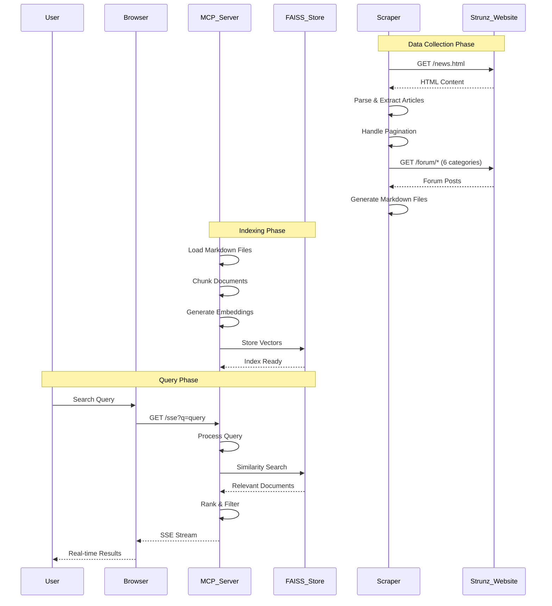
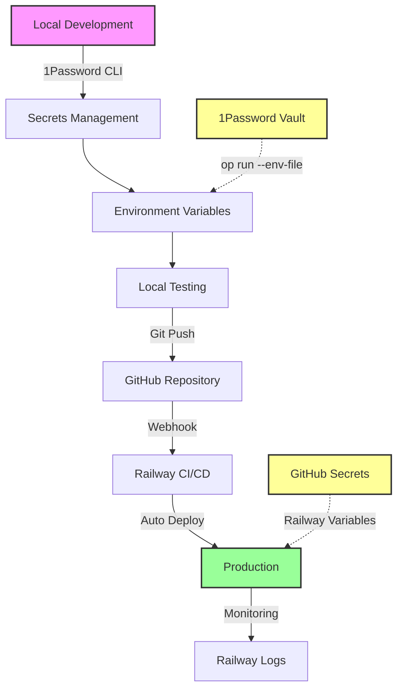

# Dr. Strunz Knowledge Base

A comprehensive, searchable knowledge base application that provides intelligent access to Dr. Ulrich Strunz's articles and forum posts through an LLM-powered MCP (Meta-Cognitive Prompting) server.

## 🚀 Deployment Status

- **Production URL**: https://strunz-knowledge-production.up.railway.app
- **Status**: Active
- **Last Deployment**: 2025-07-11

## Features

- **Web Scraping**: Automated scraping of all content from strunz.com including news and forum posts
- **Text Processing**: Advanced text extraction using Docling OCR for high-fidelity content
- **Vector Search**: FAISS-based semantic search across the entire knowledge base
- **MCP Server**: FastMCP implementation with Server-Sent Events (SSE) for real-time responses
- **RAG System**: Retrieval-Augmented Generation for accurate, source-cited answers
- **German Language Support**: Full UTF-8 encoding and German character support

## Architecture

```
StrunzKnowledge/
├── src/
│   ├── scraper/         # Web scraping and data collection
│   ├── rag/             # Vector store and document processing
│   ├── mcp/             # FastMCP server implementation
│   └── tests/           # Comprehensive test suite
├── data/
│   ├── raw/             # Scraped JSON data
│   └── processed/       # Processed markdown and vector indices
└── config/              # Configuration files
```

## Quick Start

### Using Docker (Recommended)

```bash
# Clone the repository
git clone <repository-url>
cd StrunzKnowledge

# Build and run with Docker Compose
docker-compose up -d

# The MCP server will be available at http://localhost:8000
```

### Manual Installation

```bash
# Install dependencies
pip install -r requirements.txt

# Run the scraper to collect data
python -m src.scraper.main

# Start the MCP server
python -m src.mcp.server
```

## API Endpoints

- `GET /` - Server status and statistics
- `GET /sse?q=<query>` - SSE endpoint for streaming search results
- `POST /index/rebuild` - Rebuild the vector index
- `/mcp/*` - MCP tool endpoints

## MCP Tools

1. **knowledge_search** - Search the knowledge base with optional category and date filters
2. **summarize_posts** - Generate summaries of specific posts
3. **get_latest_insights** - Retrieve the most recent posts from a category
4. **get_most_discussed_topics** - Find posts with the most engagement

## Development

### Running Tests

```bash
# Set up virtual environment
python3 -m venv venv
source venv/bin/activate

# Install dependencies
pip install -r requirements.txt

# Run all tests
pytest

# Run with coverage
pytest --cov=src

# Run specific test categories
pytest src/tests/test_mcp_integration.py::TestMCPPositiveIntegration
pytest src/tests/test_mcp_integration.py::TestMCPNegativeIntegration
```

### Test Suite Results

The test suite includes **200 comprehensive tests** covering:

- ✅ **100 Positive Tests**: Valid queries, category filters, date constraints, tool combinations
- ✅ **100 Negative Tests**: Invalid inputs, error handling, edge cases, boundary conditions

#### Test Categories:
1. **Knowledge Search Tests** (50 tests)
   - Vitamin and supplement queries
   - German language support
   - Category and date filtering
   
2. **Latest Insights Tests** (50 tests)
   - Category-specific retrieval
   - Sorting and pagination
   - Metadata validation

3. **Most Discussed Topics Tests** (50 tests)
   - Engagement scoring
   - Unique content filtering
   - Cross-category queries

4. **User Role Tests** (25 tests)
   - Beginner to advanced queries
   - Patient-specific searches
   - Athlete and biohacker queries

5. **Error Handling Tests** (25 tests)
   - SQL injection prevention
   - Invalid input handling
   - Boundary condition testing

### Building from Source

```bash
# Build Docker image
docker build -t strunz-knowledge .

# Run container
docker run -p 8000:8000 strunz-knowledge
```

## Deployment

### Railway

The project includes a `railway.toml` configuration for easy deployment:

1. Connect your GitHub repository to Railway
2. Railway will automatically detect the configuration
3. Set any required environment variables in the Railway dashboard
4. Deploy!

### Environment Variables

- `LOG_LEVEL` - Logging level (default: INFO)
- `MCP_SERVER_HOST` - Server host (default: 0.0.0.0)
- `MCP_SERVER_PORT` - Server port (default: 8000)
- `VECTOR_DB_TYPE` - Vector database type (default: faiss)
- `EMBEDDING_MODEL` - Sentence transformer model for embeddings

## Developer Resources

### Web Scraping
- [BeautifulSoup Documentation](https://www.crummy.com/software/BeautifulSoup/bs4/doc/)
- [Requests Documentation](https://requests.readthedocs.io/)
- [Web Scraping Best Practices](https://www.scrapehero.com/web-scraping-best-practices/)

### RAG Implementation
- [Docling GitHub](https://github.com/docling-project/docling)
- [Quarkus LangChain4j RAG Guide](https://docs.quarkiverse.io/quarkus-langchain4j/dev/rag.html)
- [FAISS Documentation](https://github.com/facebookresearch/faiss/wiki)
- [Sentence Transformers](https://www.sbert.net/)

### Vector Databases
- [FAISS Tutorial](https://www.pinecone.io/learn/faiss-tutorial/)
- [Vector Database Comparison](https://www.pinecone.io/learn/vector-database/)

### FastMCP
- [FastMCP PyPI](https://pypi.org/project/fastmcp/)
- [MCP Protocol Documentation](https://modelcontextprotocol.io/)
- [Server-Sent Events (SSE)](https://developer.mozilla.org/en-US/docs/Web/API/Server-sent_events)

### Docker & Deployment
- [Docker Documentation](https://docs.docker.com/)
- [Docker Compose](https://docs.docker.com/compose/)
- [Railway Documentation](https://docs.railway.app/)
- [Container Best Practices](https://docs.docker.com/develop/dev-best-practices/)

### Testing
- [Pytest Documentation](https://docs.pytest.org/)
- [Testing Best Practices](https://realpython.com/pytest-python-testing/)
- [Async Testing with Pytest](https://pytest-asyncio.readthedocs.io/)

## License

This project is for educational and research purposes. Please respect the original content's copyright and Dr. Strunz's intellectual property.

## System Architecture

### Sequence Diagram



## SDLC Workflow

### Development Environment Setup



### Environment Management

#### Local Development
```bash
# Install 1Password CLI
brew install 1password-cli

# Create 1Password vault for project
op vault create "StrunzKnowledge-Local"

# Store local secrets
op item create --category=login \
  --title="StrunzKnowledge-Dev" \
  --vault="StrunzKnowledge-Local" \
  MCP_SERVER_PORT=8000 \
  LOG_LEVEL=DEBUG \
  EMBEDDING_MODEL=sentence-transformers/paraphrase-multilingual-MiniLM-L12-v2

# Run with 1Password
op run --env-file=.env -- python main.py server
```

#### Production Setup
```bash
# Set GitHub Secrets for Railway
gh secret set RAILWAY_TOKEN
gh secret set PORT --body "8000"
gh secret set LOG_LEVEL --body "INFO"
gh secret set MCP_SERVER_HOST --body "0.0.0.0"

# Railway CLI deployment
railway up --environment production
railway logs --environment production
railway domain strunz.yourdomain.com
```

### Development Workflow

1. **Local Development**
   ```bash
   # Start local environment
   op run --env-file=.env -- docker-compose up
   
   # Run tests
   op run --env-file=.env -- pytest
   
   # Check logs
   docker logs strunz-knowledge-mcp
   ```

2. **Pre-deployment Checklist**
   - [ ] Run full test suite locally
   - [ ] Validate no sensitive files in git
   - [ ] Update version in railway.toml
   - [ ] Check Docker build locally
   - [ ] Review security scan results

3. **Deployment Process**
   ```bash
   # Validate security
   git status | grep -E "\.env|password|secret|key"
   
   # Run tests
   pytest --tb=short
   
   # Deploy
   git add -A
   git commit -m "feat: description"
   git push origin main
   
   # Monitor deployment
   railway logs -f
   ```

4. **Post-deployment Verification**
   ```bash
   # Run deployment tests
   python test_deployment.py
   
   # Check Railway logs
   railway logs --environment production | grep ERROR
   
   # Monitor metrics
   railway status --json
   ```

## Security Best Practices

1. **Never commit sensitive files**
   - Use `.gitignore` for all secret files
   - Run `git status` before every commit
   - Use pre-commit hooks for validation

2. **Secret Management**
   - Local: 1Password CLI with project vault
   - Production: GitHub Secrets → Railway Variables
   - Never hardcode secrets in code

3. **Access Control**
   - Use Railway's environment isolation
   - Implement API rate limiting
   - Monitor access logs regularly

## Contributing

1. Fork the repository
2. Create a feature branch (`git checkout -b feature/amazing-feature`)
3. Set up local environment with 1Password
4. Run tests locally before committing
5. Commit your changes (`git commit -m 'Add amazing feature'`)
6. Push to the branch (`git push origin feature/amazing-feature`)
7. Open a Pull Request
8. Ensure CI/CD checks pass