# Dr. Ulrich Strunz Knowledge Base

## Table of Contents

- [Project Description & Purpose](#-project-description--purpose)

### 🌟 For Health Enthusiasts & Practitioners
- [User Journey & Roles](#user-journey--roles)
  - [Functional Medicine Expert](#-functional-medicine-expert)
  - [Community Researcher](#-community-researcher)
  - [Longevity Enthusiast](#-longevity-enthusiast)
  - [Dr. Strunz Fan](#-dr-strunz-fan)
  - [Health Optimizer](#-health-optimizer)
- [Use Cases & LLM Integration](#use-cases--llm-integration)
- [Personalized Health Assessment](#-personalized-health-assessment--journey-mapping)
- [Dr. Strunz Newsletter Analysis](#-dr-strunz-newsletter-analysis-2004-2025)
- [Knowledge Activation Principle](#knowledge-activation-principle)
- [Content Sources & Statistics](#content-sources)
- [Forum Analysis & Insights](#forum-analysis)
- [Getting Started](#getting-started)
- [Search Guide](#search-guide)
- [Claude Web (claude.ai) Configuration](#claude-web-claudeai-configuration-)
- [Claude Desktop Configuration](#claude-desktop-configuration)

### 🔧 For Developers & Integrators
- [Technical Architecture](#technical-architecture)
- [Enhanced MCP Server](#enhanced-mcp-server)
- [Development Setup](#development-setup)
- [Testing & Quality Assurance](#testing--quality-assurance)
- [Deployment Guide](#deployment-guide)
- [SDLC Process](#sdlc-process)
- [MCP Integration & Specifications](#-mcp-integration--specifications)
- [Railway Endpoint & Integration](#-railway-endpoint--integration)

---

## 🎯 Project Description & Purpose

### 🏆 Honoring a Pioneer of Modern Preventive Medicine

> *"The medicine of the future is molecular medicine. We will no longer treat diseases, but prevent them by optimizing our biochemistry at the cellular level."*  
> — Dr. med. Ulrich Strunz

### 🌟 Dr. Ulrich Strunz: A Medical Visionary

Dr. med. Ulrich Strunz stands as one of Germany's most influential physicians and pioneers in preventive, molecular, and functional medicine. For over four decades, he has revolutionized our understanding of health optimization, transforming lives through evidence-based nutritional medicine and lifestyle interventions.

**His Extraordinary Achievements:**

🏃‍♂️ **Triathlon Pioneer & Performance Expert**
- One of Germany's first marathon runners and triathlon athletes
- Completed over 40 marathons and multiple Ironman competitions
- Developed revolutionary sports nutrition protocols that transformed athletic performance

📚 **Prolific Medical Author & Educator**
- Author of **40+ bestselling books** on health optimization
- Books translated into multiple languages, reaching millions worldwide
- Created the "No Carb" and "Low Carb" dietary revolution in German-speaking countries

🔬 **Molecular Medicine Pioneer**
- Early advocate of amino acid therapy and orthomolecular medicine
- Developed groundbreaking protocols for vitamin and mineral optimization
- Pioneered the integration of laboratory diagnostics with nutritional intervention

🏥 **Clinical Excellence & Innovation**
- Established leading practice for preventive medicine in Roth, Germany
- Trained thousands of physicians in functional medicine approaches
- Developed comprehensive "Blood Tuning" protocols for optimal health

🌍 **Global Health Movement Leader**
- Influenced millions through his website, books, and medical practice
- Created vibrant communities of health-conscious individuals
- Advocated for personal responsibility in health optimization

### 🎯 Mission: Making Dr. Strunz's Wisdom Accessible

This knowledge base is a tribute to Dr. Strunz's life work—making his revolutionary insights in preventive and functional medicine accessible to everyone seeking optimal health and longevity. Through **Knowledge Activation**, we transform his static wisdom into personalized, actionable guidance for your unique health journey.

**For Everyone Ready to:**
- 🔬 Optimize their biochemistry for peak performance
- 🏃‍♂️ Achieve athletic excellence through proper nutrition
- 🧬 Prevent disease through molecular medicine principles
- 💪 Experience the vitality that comes from optimal health
- 🌱 Start their longevity journey with scientific precision

### 📖 His Greatest Literary Contributions

Dr. Strunz's books represent decades of clinical experience and scientific research:

- **"Die Amino-Revolution"** - Revolutionary amino acid therapy protocols
- **"Der Gen-Trick"** - Epigenetic optimization for longevity  
- **"Das Stress-weg-Buch"** - Mastering stress through biochemical balance
- **"Blut - Die Geheimnisse unseres flüssigen Organs"** - Blood optimization secrets
- **"Das neue Anti-Krebs-Programm"** - Cancer prevention through nutrition

*Each book contains life-changing insights that have helped millions achieve optimal health.*

---


## User Journey & Roles

### 🎯 Who Benefits from Dr. Strunz's Knowledge?

Dr. Strunz's comprehensive approach to health optimization serves diverse user communities, each with unique needs and expertise levels. Our enhanced MCP system personalizes the knowledge activation process for maximum impact.


### 👨‍⚕️ Functional Medicine Expert

**Profile:** Licensed healthcare practitioners integrating Dr. Strunz's molecular medicine approach into clinical practice

**Complete User Journey:**


**Detailed Workflow Stages:**

**🔍 Research & Discovery (15-45 min)**
- **Newsletter Analysis**: Search 20+ years of Dr. Strunz articles for specific conditions
- **Contradiction Mapping**: Identify conflicts between mainstream and functional approaches
- **Evidence Integration**: Combine book protocols with latest research findings
- **Community Validation**: Review real-world outcomes from forum discussions

**🧬 Protocol Development (30-60 min)**  
- **Personalized Protocols**: Create evidence-based treatment plans
- **Supplement Safety**: Analyze interactions and optimize dosing
- **Timeline Planning**: Establish realistic expectations and milestones
- **Patient Education**: Develop clear implementation guidance

**📊 Clinical Implementation (Ongoing)**
- **Progress Monitoring**: Track biomarkers and symptom improvements
- **Protocol Refinement**: Adjust based on patient response
- **Outcome Documentation**: Record successes for community benefit
- **Professional Development**: Share insights with medical colleagues

**Key Use Cases:**
- **Complex Case Resolution**: Chronic fatigue with multiple deficiencies
- **Preventive Protocol Design**: Longevity optimization for healthy patients  
- **Supplement Optimization**: High-performance athlete nutrition
- **Patient Education**: Teaching molecular medicine principles

### 🔬 Community Researcher

**Profile:** Health researchers, journalists, and analysts studying health trends and community insights from Dr. Strunz's extensive archives

**Advanced Research Journey:**


**Newsletter Evolution Analysis (2004-2025):**

**📈 Content Era Analysis:**
- **2004-2010**: Foundation Building (1,234 articles)
  - Focus: Basic nutrition, fitness fundamentals, blood analysis introduction
  - Tone: Educational and foundational
  
- **2011-2018**: Molecular Medicine Expansion (2,890 articles)  
  - Focus: Advanced nutrition, supplement protocols, personalized medicine
  - Tone: Scientific and specialized
  
- **2019-2021**: Pandemic Response (1,456 articles)
  - Focus: Corona prevention, immune system, Vitamin D critical role
  - Tone: Urgent and advocacy-focused
  
- **2022-2025**: Advanced Integration (1,373 articles)
  - Focus: Longevity protocols, epigenetics, precision medicine  
  - Tone: Visionary and comprehensive

**🎯 Research Capabilities:**
- **Topic Trend Tracking**: 20+ years of health topic evolution
- **Event Impact Analysis**: How Corona, research breakthroughs, book releases affected content
- **Engagement Pattern Recognition**: Most discussed topics and community response
- **Cross-Reference Validation**: Newsletter vs forum vs book consistency analysis

### 🧬 Longevity Enthusiast

**Profile:** Individuals focused on extending healthspan and optimizing aging processes through Dr. Strunz's molecular medicine approach

**Comprehensive Longevity Journey:**


**📊 Newsletter Longevity Topic Evolution:**
- **2004-2015**: Anti-aging as secondary benefit (89 mentions)
- **2016-2020**: Specific longevity protocols develop (187 mentions)  
- **2021-2025**: Primary focus with epigenetic insights (456 mentions)
- **Peak Content**: 2023-2025 with "Der Gen-Trick" publication influence

**🎯 Longevity-Specific Capabilities:**
- **Epigenetic Protocol Design**: Based on latest newsletter insights and "Der Gen-Trick"
- **Biomarker Optimization**: Tracking 20+ longevity markers with Dr. Strunz ranges
- **Community Success Stories**: Learning from 22 years of forum longevity discussions
- **Advanced Supplement Stacks**: Multi-layered approach with safety analysis

## 📰 Dr. Strunz Newsletter Analysis (2004-2025)

### 🎯 Editorial Excellence: 20+ Years of Health Innovation

Dr. Strunz's daily newsletter represents one of the longest-running, most consistent health publications in German-speaking countries. With **6,953 articles** spanning over two decades, it provides unique insights into the evolution of preventive and molecular medicine.

#### 📊 Newsletter Overview


#### 📈 Content Evolution Timeline


### 🔬 Guest Authors & Editorial Approach

**Unique Single-Author Strategy:**
Dr. Strunz maintains **personal authorship** of virtually all newsletter content, a rare approach in health media that ensures:

- **Message Consistency**: Unified philosophy across 20+ years
- **Personal Connection**: Direct doctor-reader relationship  
- **Scientific Integrity**: Single expert voice maintains credibility
- **Editorial Control**: Coherent progression of ideas and concepts

**Content Sources:**
- **40+ Years Clinical Experience**: Personal patient insights
- **International Research Synthesis**: Latest medical literature
- **Continuing Medical Education**: Conference participation and learning
- **Real-World Validation**: Patient outcomes and case studies

### 📋 Major Topic Trends & Evolution

#### 🧬 Vitamin D Revolution (1,247 mentions)


**Peak Years**: 2020-2022 (Corona pandemic drives massive interest)
**Evolution**: From basic supplementation to personalized optimization protocols

#### 🦠 Corona Response Analysis (573 articles)


#### 🌱 Longevity Medicine Emergence (456 mentions)
- **2004-2015**: Anti-aging as secondary benefit
- **2016-2020**: Specific longevity protocols develop
- **2021-2025**: Primary focus with epigenetic insights
- **Catalyst**: "Der Gen-Trick" publication in 2022

### 🎯 Newsletter Content Characteristics

**Writing Style Evolution:**
- **Early Years (2004-2010)**: Educational and foundational
- **Middle Years (2011-2018)**: Scientific and specialized  
- **Pandemic Years (2019-2021)**: Urgent and advocacy-focused
- **Recent Years (2022-2025)**: Visionary and comprehensive

**Content Depth:**
- **Average Article Length**: 800-1,200 words
- **Scientific References**: 2-5 studies per article
- **Practical Application**: Always includes actionable advice
- **Personal Touch**: Patient stories and clinical experiences

### 📱 Access via Enhanced MCP Tools

**Newsletter-Specific MCP Capabilities:**
- **`analyze_strunz_newsletter_evolution`** - Track content evolution over time
- **`get_guest_authors_analysis`** - Understand editorial approach and sources
- **`track_health_topic_trends`** - Follow specific topic development
- **Newsletter Search Integration** - All knowledge search tools include newsletter content

**Use Cases:**
- **Topic Research**: "How has Dr. Strunz's vitamin D recommendations evolved?"
- **Timeline Analysis**: "Show me Corona-related content progression 2020-2025"
- **Content Discovery**: "Find all longevity articles from the last 3 years"
- **Evidence Tracking**: "What research did Dr. Strunz cite for amino acid protocols?"

### 💙 Dr. Strunz Fan

**Profile:** Dedicated followers who study Dr. Strunz's complete philosophy, understanding the deep connections between molecular medicine, epigenetics, and optimal health

**Comprehensive Knowledge Journey:**


**📚 The 12 Hallmarks of Aging - Dr. Strunz Integration:**

**1. Genomic Instability**
- **Dr. Strunz Approach**: High-dose antioxidants (Vitamin C, E, Selenium)
- **Newsletter Evolution**: From basic antioxidants (2004) to targeted DNA protection (2025)
- **Key Protocol**: NAC + Alpha-Lipoic Acid + Astaxanthin

**2. Telomere Attrition**
- **Dr. Strunz Approach**: Omega-3 optimization (EPA/DHA ratio)
- **Book Reference**: "Der Gen-Trick" Chapter 4
- **Cofactors**: Vitamin D3 + Magnesium + Zinc

**3. Epigenetic Alterations**
- **Dr. Strunz Approach**: Methyl donor optimization
- **Key Nutrients**: B12, Folate, SAMe, Betaine
- **Lifestyle Integration**: Fasting protocols + cold exposure

**4. Loss of Proteostasis**
- **Dr. Strunz Approach**: Complete amino acid profile
- **Book Reference**: "Die Amino-Revolution" - all chapters
- **Daily Protocol**: 20g essential aminos + digestive enzymes

**5. Deregulated Nutrient Sensing**
- **Dr. Strunz Approach**: Strategic carb restriction + protein cycling
- **Newsletter Topics**: mTOR modulation, insulin optimization
- **Supplements**: Berberine, Resveratrol, Quercetin

**6. Mitochondrial Dysfunction**
- **Dr. Strunz Approach**: CoQ10 + PQQ + Mitochondrial nutrients
- **Exercise Integration**: HIIT + strength training
- **Cofactor Stack**: B-Complex + Magnesium + D-Ribose

**7. Cellular Senescence**
- **Dr. Strunz Approach**: Senolytic nutrients + fasting
- **Key Compounds**: Fisetin, Quercetin, EGCG
- **Forum Success Stories**: Documented reversals

**8. Stem Cell Exhaustion**
- **Dr. Strunz Approach**: Growth factor optimization
- **Amino Focus**: Arginine, Glycine, Proline
- **Lifestyle**: Sleep optimization + stress reduction

**9. Altered Intercellular Communication**
- **Dr. Strunz Approach**: Inflammation control
- **Omega Balance**: 1:1 to 1:3 Omega-6:Omega-3
- **Anti-inflammatory Stack**: Curcumin + Boswellia + Fish Oil

**10. Disabled Macroautophagy**
- **Dr. Strunz Approach**: Intermittent fasting + autophagy triggers
- **Supplement Support**: Spermidine, Nicotinamide
- **Newsletter Coverage**: 234 articles on fasting benefits

**11. Chronic Inflammation**
- **Dr. Strunz Approach**: Multi-target anti-inflammatory protocol
- **Core Stack**: Vitamin D3 (8000 IU) + K2 + A + E
- **Measurement**: hs-CRP < 0.5 mg/L target

**12. Dysbiosis**
- **Dr. Strunz Approach**: Microbiome optimization
- **Protocol**: Probiotics + Prebiotics + Fermented foods
- **Testing**: Regular microbiome analysis

**🔬 Vitamin D Mastery - Complete Cofactor System:**

```mermaid
graph LR
    A[Vitamin D3<br/>4000-8000 IU] --> B[Primary Cofactors]
    
    B --> C[Magnesium<br/>400-800mg<br/>Glycinate/Citrate]
    B --> D[Vitamin K2<br/>100-200mcg<br/>MK-7 form]
    B --> E[Vitamin A<br/>5000-10000 IU<br/>Retinol]
    
    A --> F[Secondary Cofactors]
    F --> G[Zinc<br/>15-30mg]
    F --> H[Boron<br/>3-6mg]
    F --> I[Omega-3<br/>2-4g EPA/DHA]
    
    C --> J[Optimization]
    D --> J
    E --> J
    G --> J
    H --> J
    I --> J
    
    J --> K[25(OH)D Target<br/>60-80 ng/ml]
    
    style A fill:#fff9c4
    style J fill:#c8e6c9
    style K fill:#e1f5fe
```

**📊 Newsletter Philosophy Evolution Timeline:**

- **2004-2008**: Foundation Building - "Vitamins as medicine"
- **2009-2012**: Molecular Revolution - "Amino acids change everything"
- **2013-2016**: Blood Tuning Era - "Measure, don't guess"
- **2017-2020**: Personalization Wave - "Your genes, your protocol"
- **2021-2025**: Epigenetic Mastery - "Control your genetic expression"

**🎯 Dr. Strunz Fan Capabilities:**
- **Complete Works Navigation**: All 13 books cross-referenced with 6,953 newsletters
- **Philosophy Evolution Tracking**: Understanding how concepts developed over 20+ years
- **Contradiction Resolution**: When Dr. Strunz updated his recommendations and why
- **Teaching Mastery**: Ability to explain complex concepts simply
- **Protocol Integration**: Combining multiple approaches for synergistic effects

### ⚡ Health Optimizer

**Profile:** Performance-driven individuals optimizing every aspect of health through data-driven protocols, targeting peak physical, cognitive, and cellular performance

**Advanced Optimization Journey:**


**🎯 Master Optimization Stack - Complete System:**

**Morning Protocol (Peak Mental Performance)**
```mermaid
timeline
    title Morning Optimization Timeline
    
    section 6:00 AM
    Wake         : Hydration Protocol
                 : 500ml water Sea salt Lemon
            
    section 6:30 AM  
    Pre-Workout  : Amino Acid Complex 10g
                 : L-Citrulline 6g
                 : Beta-Alanine 3g
                
    section 7:30 AM
    Post-Workout : Vitamin D3 4000 IU K2 100mcg
                 : Magnesium Glycinate 400mg
                 : Omega-3 2g EPA DHA
                 : Zinc Picolinate 15mg
                 
    section 8:00 AM
    Breakfast    : B-Complex activated forms
                 : Vitamin C 1000mg
                 : CoQ10 200mg
                 : PQQ 20mg
```

**🧬 12 Hallmarks Optimization Protocol:**

**1. Genomic Instability Prevention**
- **Morning**: NAC 600mg + Vitamin C 1000mg + E 400 IU
- **Evening**: Astaxanthin 12mg + Selenium 200mcg
- **Lifestyle**: HIIT 3x/week for DNA repair activation

**2. Telomere Protection**
- **Core**: Omega-3 4g daily (split doses)
- **Cofactors**: Vitamin D3 + Folate + B12
- **Newsletter Insight**: "Omega-3 extends telomeres by 5% in 5 years"

**3. Epigenetic Optimization**
- **Methylation**: TMG 1000mg + SAMe 400mg
- **HDAC Modulation**: Sulforaphane 50mg + Resveratrol 500mg
- **Lifestyle**: 16:8 fasting + cold exposure

**4. Protein Quality Control**
- **Pre-Training**: EAAs 15g with leucine emphasis
- **Post-Training**: Whey isolate 30g + digestive enzymes
- **Daily Total**: 2.2g/kg body weight minimum

**5. Nutrient Sensing Optimization**
- **mTOR Cycling**: Protein cycling protocol
- **AMPK Activation**: Berberine 500mg 2x daily
- **Insulin Sensitivity**: Chromium + Alpha-lipoic acid

**6. Mitochondrial Enhancement**
- **Core Stack**: CoQ10 + PQQ + MitoQ
- **Energy Support**: D-Ribose 5g pre-workout
- **Newsletter Topic**: 178 articles on mitochondrial health

**7. Senescent Cell Clearance**
- **Senolytics**: Fisetin 100mg (pulsed dosing)
- **Support**: Quercetin 500mg + EGCG 300mg
- **Protocol**: 3 days on, 4 days off

**8. Stem Cell Support**
- **Amino Focus**: Arginine 5g + Glycine 10g + Proline 5g
- **Growth Factors**: Colostrum + Beta-glucans
- **Exercise**: Zone 2 cardio for stem cell activation

**9. Inflammation Control**
- **Omega Balance**: Track AA/EPA ratio < 3:1
- **Polyphenols**: Curcumin 1000mg + Boswellia 500mg
- **Target**: hs-CRP < 0.3 mg/L

**10. Autophagy Activation**
- **Fasting**: 16:8 daily + 24hr weekly
- **Supplements**: Spermidine 5mg + Nicotinamide 500mg
- **Exercise**: Fasted morning training

**11. Advanced Anti-Inflammatory**
- **Vitamin D System**: D3 6000 IU + all cofactors
- **Resolution**: SPMs (specialized pro-resolving mediators)
- **Testing**: Monthly inflammatory panel

**12. Microbiome Optimization**
- **Probiotics**: Strain-specific for goals
- **Prebiotics**: Diverse fiber sources 40g+
- **Testing**: Quarterly microbiome analysis

**📊 Biomarker Optimization Targets:**

| Biomarker | Standard Range | Dr. Strunz Optimal | Elite Performance |
|-----------|----------------|-------------------|-------------------|
| 25(OH)D | 30-100 ng/ml | 60-80 ng/ml | 70-90 ng/ml |
| Omega-3 Index | >4% | >8% | 10-12% |
| hs-CRP | <3.0 mg/L | <0.5 mg/L | <0.3 mg/L |
| Ferritin | 30-400 ng/ml | 50-150 ng/ml | 80-120 ng/ml |
| Free Testosterone | Age-dependent | Upper quartile | Top 10% |
| IGF-1 | 50-300 ng/ml | 150-250 ng/ml | 200-250 ng/ml |
| HbA1c | <5.7% | <5.4% | <5.2% |
| Homocysteine | <15 μmol/L | <8 μmol/L | <6 μmol/L |

**🚀 Performance Enhancement Timeline:**


**💡 Health Optimizer MCP Integration:**
- **Tool Usage**: Daily interaction with all 13 MCP tools
- **Data Analysis**: Weekly biomarker tracking and trend analysis
- **Protocol Updates**: Monthly optimization based on newsletter insights
- **Community Sharing**: Documented results in forum for others
- **Continuous Learning**: Integration of new research within 48 hours

## Use Cases & LLM Integration

### 🤖 How Users Work with LLM + MCP Server

The enhanced MCP server provides LLMs with comprehensive context and specialized tools to deliver expert-level guidance based on Dr. Strunz's principles.

#### Use Case 1: Vitamin D Optimization Protocol

**User Query:** "I'm tired all the time and suspect vitamin D deficiency. Help me create an optimization protocol."

**LLM + MCP Workflow:**


#### Use Case 2: Athletic Performance Enhancement

**User Query:** "I'm training for a triathlon. How can I optimize my nutrition and supplementation using Dr. Strunz's approach?"

**Enhanced Information Provided to LLM:**
- **Books**: Sports nutrition protocols from "Fitness drinks" and "Die neue Diät"
- **News**: Latest research on performance nutrition and recovery
- **Forum**: Success stories from endurance athletes following Dr. Strunz protocols
- **Synthesis**: Comprehensive approach combining all sources

**MCP Tools Used:**
- `nutrition_calculator()` - Calculate needs based on training volume
- `analyze_supplement_stack()` - Optimize supplement timing around training
- `get_community_insights()` - Learn from other athletes' experiences
- `trace_topic_evolution()` - See how sports nutrition recommendations evolved

#### Use Case 3: Optimal Lab Value Interpretation 🆕

**User Query:** "I'm a 35-year-old male athlete. My vitamin D is 45 ng/ml and ferritin is 80 ng/ml. Are these optimal?"

**MCP Tools Used:**
- `get_optimal_diagnostic_values(age=35, gender="male", athlete=True)`

**Enhanced Response:**
```
Based on Dr. Strunz's optimal values for a 35-year-old male athlete:

📊 Your Current vs Optimal Values:
- Vitamin D (25-OH): 45 ng/ml → Target: 70-80 ng/ml (Higher for athletes)
- Ferritin: 80 ng/ml → Target: 150-250 ng/ml (Athletes need higher iron stores)

Recommendations:
1. Vitamin D: Increase to 6000-8000 IU daily with K2 cofactor
2. Ferritin: Consider iron supplementation with vitamin C
3. Retest in 8-12 weeks

Note: These are Dr. Strunz's OPTIMAL ranges for peak performance, 
not just "normal" ranges that prevent disease.
```

#### Use Case 4: Longevity Protocol Development

**User Query:** "I'm 45 and want to create a comprehensive longevity protocol. What does Dr. Strunz recommend?"

**System Prompt for LLM:**
```
You are Dr. Strunz's knowledge base assistant. The user wants longevity optimization.

CONTEXT PROVIDED:
- User age: 45
- Goal: Comprehensive longevity protocol
- Available: All Dr. Strunz books, 22 years of forum discussions, latest research

APPROACH:
1. Use create_health_protocol() for longevity focus
2. Cross-reference "Der Gen-Trick" for epigenetic insights
3. Use get_community_insights() for real-world experiences
4. Apply trace_topic_evolution() to see how longevity understanding evolved
5. Include specific dosing from "Die Amino-Revolution"

DELIVERABLE:
Comprehensive longevity protocol with:
- Foundational supplements (Vitamin D, Magnesium, Amino acids)
- Advanced interventions (based on latest research)
- Lifestyle integration strategies
- Monitoring and adjustment protocols
- Timeline and expectations
```

## 🎯 Personalized Health Assessment & Journey Mapping

### Dynamic User Profiling System

The enhanced MCP server now includes comprehensive health assessment capabilities that create personalized health journeys based on individual profiles.

**New MCP Tools for Personalization:**

#### 1. `get_health_assessment_questions()`
Provides comprehensive health questionnaire covering:
- Basic demographics and health status
- Current symptoms and medical conditions
- Lifestyle factors (sleep, stress, activity)
- Supplement usage and experience
- Goals and commitment level
- Dr. Strunz experience level

#### 2. `assess_user_health_profile()`
Creates detailed health profile including:
- Automatic role assignment (Functional Expert, Longevity Enthusiast, etc.)
- Personalized journey plan
- Immediate action priorities
- Comprehensive assessment report

#### 3. `create_personalized_protocol()`
Generates fully customized protocols with:
- Foundation supplements with timing
- Condition-specific interventions
- Nutrition guidelines based on goals
- Exercise plans adapted to fitness level
- Lifestyle modifications
- Monitoring schedules
- Expected improvement timeline

### Example User Assessment Flow


### Sample Personalized Protocol Output

**For a 45-year-old with fatigue and longevity goals:**

**Immediate Actions (Week 1):**
1. **Foundation Protocol Start**
   - Vitamin D3 4000 IU + K2 100mcg (morning)
   - Magnesium Glycinate 400mg (evening)
   - Omega-3 2g EPA/DHA (with meals)

2. **Energy Restoration**
   - CoQ10 200mg (morning)
   - B-Complex activated forms (morning)
   - Amino acids 10g (pre-activity)

3. **Lifestyle Modifications**
   - Sleep optimization: 10pm bedtime routine
   - Stress reduction: 5-min morning breathing
   - Movement: 20-min daily walks

**Expected Timeline:**
- Week 1-2: Noticeable energy improvement
- Week 3-4: Better sleep quality
- Month 2: Stable all-day energy
- Month 3: Optimal biomarker improvements
- Month 6: Full protocol integration

## Overview

This project provides a comprehensive searchable database of Dr. Strunz's health and nutrition content, featuring advanced semantic search capabilities and deep analytical insights into community health discussions spanning over two decades.

### Key Statistics
- **13 books** covering topics from nutrition to stress management
- **6,953 news articles** spanning from September 2004 to July 2025
- **14,435 forum posts** from 902 unique authors (2003-2025)
- **43,373 indexed text chunks** for semantic search

## Content Sources

### Books Collection

The knowledge base includes 13 carefully curated books by Dr. Ulrich Strunz:

#### 1. Fitness & Nutrition
- **Das Strunz-Low-Carb-Kochbuch** (2016) - Comprehensive low-carb recipes
- **No-Carb-Smoothies** (2015) - Sugar-free smoothie recipes
- **Fitness drinks** (2002) - Sports nutrition beverages
- **Die neue Diät Das Fitnessbuch** (2010) - Modern fitness nutrition

#### 2. Health & Healing
- **Wunder der Heilung** (2015) - Healing miracles through nutrition
- **Heilung erfahren** (2019) - Experience healing naturally
- **Das Geheimnis der Gesundheit** (2010) - Health secrets revealed
- **77 Tipps für Rücken und Gelenke** (2021) - Back and joint health

#### 3. Specialized Topics
- **Die Amino-Revolution** (2022) - Revolutionary amino acid therapy
- **Das neue Anti-Krebs-Programm** (2012) - Cancer prevention strategies
- **Blut - Die Geheimnisse unseres flüssigen Organs** (2016) - Blood optimization
- **Das Stress-weg-Buch** (2022) - Stress management techniques
- **Der Gen-Trick** (2025) - Epigenetic health optimization

### News Articles

- **Source**: https://www.strunz.com/news/
- **Time Span**: September 2004 - July 2025
- **Total Articles**: 6,953
- **Topics Covered**:
  - Nutritional science updates
  - Vitamin and mineral research
  - Exercise physiology
  - Preventive medicine
  - Clinical case studies

### Forum Discussions

- **Time Span**: 2003 - 2025
- **Total Posts**: 14,435 chunks
- **Unique Authors**: 902
- **Categories**:
  - Fitness (27.8%)
  - Bluttuning (17.0%)
  - Mental Health (16.2%)
  - General Health (14.3%)
  - General Topics (13.6%)
  - Nutrition (11.2%)

## Knowledge Activation Principle

### What is Knowledge Activation?

Knowledge Activation is the core principle behind the Dr. Strunz Knowledge Base. It transforms static health information into actionable, contextual insights through intelligent retrieval and synthesis.


### How Knowledge Activation Works

1. **Semantic Encoding**
   - All content is transformed into 384-dimensional vectors
   - Captures meaning beyond keywords
   - Enables cross-language understanding (German/English)

2. **Contextual Retrieval**
   - User queries activate relevant knowledge clusters
   - FAISS enables millisecond-speed similarity search
   - Multiple sources provide comprehensive perspectives

3. **Intelligent Synthesis**
   - MCP server combines related information
   - Preserves Dr. Strunz's medical expertise
   - Delivers coherent, actionable responses

### Benefits of Knowledge Activation

| Traditional Search | Activated Knowledge |
|-------------------|---------------------|
| Keyword matching | Semantic understanding |
| Single results | Synthesized insights |
| Static information | Contextual recommendations |
| Manual correlation | Automatic connections |

### Example: Activating Knowledge About "Vitamin D"

```python
# User Query
"Vitamin D Mangel Symptome"

# Knowledge Activation Process
1. Semantic Analysis → Understands: deficiency, symptoms, vitamin D
2. Multi-Source Retrieval →
   - Book: "Die Amino-Revolution" (optimal dosing)
   - News: Recent studies on deficiency
   - Forum: User experiences and solutions
3. Synthesis →
   - Symptoms: Fatigue, bone pain, immune weakness
   - Dr. Strunz recommendation: 4000-8000 IU daily
   - Best practices: Morning intake with fat
   - Community insights: Success stories
```

## Forum Analysis & Insights

### Corona-Pandemie Impact (2020-2025)

The forum shows a dramatic spike in Corona-related discussions starting in 2020:

| Year | Corona Posts | Total Likes | Main Topics |
|------|-------------|-------------|-------------|
| 2020 | 124 | 1,413 | Prevention, Vitamins |
| 2021 | 356 | 5,760 | Vaccine criticism, Side effects |
| 2022 | 113 | 1,624 | Spike protein, Long-COVID |
| 2023 | 88 | 535 | Review & reflection |
| 2024 | 408 | 2,215 | Long-term effects |
| 2025 | 213 | 304 | New findings |

**Key Insights:**
- Peak discussions in 2021 focusing on vaccine criticism
- Strong community focus on natural prevention (Vitamins D, C, Zinc)
- Critical examination of official measures
- High engagement rates (5,760 likes in 2021)

### Medical Trend Analysis

#### Growing Topic Areas (2015-2025)

| Topic | 2015 | 2025 | Growth |
|-------|------|------|--------|
| Molecular Medicine | 2 | 57 | ↗️ +2750% |
| Functional Medicine | 1 | 20 | ↗️ +1900% |
| Longevity | 1 | 7 | ↗️ +600% |
| Epigenetics | 0 | 5 | ↗️ New |

#### Topic Distribution by Year

**2024** (3,055 posts):
1. Diet/Nutrition: 18.8%
2. Amino Acids: 15.4%
3. Vitamins: 14.9%
4. Minerals: 14.3%
5. Corona: 12.5%

**2025** (2,458 posts):
1. Vitamins: 17.9%
2. Nutrition: 17.2%
3. Amino Acids: 12.5%
4. Minerals: 10.1%
5. Cardiovascular: 9.6%

### Community Dynamics

#### Forum Activity Timeline

```
Year    Posts   Visualization
----    -----   -------------
2016       27   
2017      449   █████
2018      796   ██████████
2019    1,049   █████████████
2020    1,102   ██████████████
2021    1,287   ████████████████
2022      858   ███████████
2023    1,094   ██████████████
2024    3,055   ████████████████████████████████████████
2025    2,458   ████████████████████████████████
```

#### Top Contributors by Engagement

| Author | Posts | Total Likes | Avg Likes/Post |
|--------|-------|-------------|----------------|
| :-) | 615 | 7,057 | 11.5 |
| Robert K. | 286 | 2,238 | 7.8 |
| Albrecht | 402 | 2,402 | 6.0 |
| Thomas V. | 674 | 2,383 | 3.5 |

### Topic Evolution Visualizations


The comprehensive visualization above shows:
1. **Forum Activity Timeline** - Clear correlation with major events
2. **Corona Discussion Analysis** - Posts vs engagement metrics
3. **Medical Topics Heatmap** - Evolution of health discussions
4. **Category Distribution** - Community interest areas
5. **Topic Evolution** - Trending health topics over time
6. **Author Engagement** - Community participation patterns
7. **Monthly Patterns** - Seasonal activity variations
8. **Keyword Analysis** - Most discussed health terms

## Getting Started

### Quick Start for Users

1. **Access the Knowledge Base**
   ```bash
   # Clone and setup
   git clone https://github.com/yourusername/StrunzKnowledge.git
   cd StrunzKnowledge
   ```

2. **Search for Information**
   ```python
   # Simple search example
   from src.rag.search import search_knowledge
   
   results = search_knowledge("Vitamin D Dosierung")
   for result in results:
       print(f"{result.source}: {result.title}")
       print(f"Relevance: {result.score}")
       print(f"Content: {result.text[:200]}...\\n")
   ```

3. **Filter by Content Type**
   - Books: Deep, comprehensive information
   - News: Latest research and updates
   - Forum: Community experiences and discussions

## Search Guide

### Effective Search Strategies

1. **Medical Conditions**
   - Example: "Diabetes Typ 2 Ernährung"
   - Example: "Bluthochdruck natürlich senken"

2. **Nutrients & Supplements**
   - Example: "Magnesium Mangel Symptome"
   - Example: "Omega 3 Dosierung"

3. **Lifestyle Topics**
   - Example: "Low Carb Rezepte"
   - Example: "Intervallfasten Anleitung"

### Search Tips
- Use German terms for best results
- Combine topics: "Vitamin D + Corona"
- Be specific: "Aminosäuren Sport" vs just "Sport"

## Claude Web (claude.ai) Configuration ✅

**For Claude Web users**, simply add this MCP server:

```
Server URL: https://strunz.up.railway.app/mcp
Authentication: Bearer token (automatic)
```

**Available Tools:**
- `knowledge_search` - Search Dr. Strunz knowledge base
- `get_optimal_diagnostic_values` - Get personalized optimal lab ranges  
- `create_health_protocol` - Create health optimization protocols
- `analyze_supplement_stack` - Analyze supplement combinations
- `get_dr_strunz_biography` - Get Dr. Strunz background

Claude.ai will automatically:
- Detect OAuth support
- Handle authentication flow
- Connect via SSE transport
- Provide access to all 20 tools immediately!

## Claude Desktop Configuration

Download Claude Desktop on the [Website](https://claude.ai/download).Add this configuration to your setting/connectors:


---

# Developer Documentation

## Technical Architecture

### System Overview


### Data Processing Pipeline


### Search & Retrieval Architecture


## SDLC Process

### Software Development Life Cycle - Technical Sequence

```mermaid
sequenceDiagram
    participant Dev as Developer
    participant Local as Local Environment
    participant Git as GitHub Repository
    participant GA as GitHub Actions
    participant Railway as Railway Platform
    participant Users as MCP Clients
    
    %% Initial Development Phase
    Note over Dev,Local: Phase 1: Initial Development
    Dev->>Local: Develop scrapers & processors
    Dev->>Local: Process all content sources
    Local->>Local: Generate FAISS indices
    Local->>Local: Test MCP server locally
    
    Dev->>Git: git push (code + initial indices)
    Git->>Git: Store code and index files
    
    %% Deployment Phase
    Note over Git,Railway: Phase 2: Initial Deployment
    Git->>Railway: Webhook trigger
    Railway->>Railway: Build Docker image
    Railway->>Railway: Deploy MCP server
    Railway->>Railway: Load FAISS indices
    Railway->>Users: MCP server live ✓
    
    %% Daily Update Cycle
    Note over GA,Railway: Phase 3: Daily Updates (Automated)
    loop Every 24 hours at 02:00 UTC
        GA->>GA: Cron trigger
        GA->>GA: Run news scraper
        GA->>GA: Check for new content
        alt New content found
            GA->>GA: Process new articles
            GA->>GA: Update FAISS indices
            GA->>Git: Commit updated indices
            Git->>Railway: Trigger deployment
            Railway->>Railway: Rolling update
            Railway->>Users: Updated content available
        else No new content
            GA->>GA: Log "No updates"
        end
    end
    
    %% User Interaction
    Note over Railway,Users: Phase 4: Production Usage
    Users->>Railway: MCP tool requests
    Railway->>Railway: Search FAISS index
    Railway->>Users: Return results
    
    %% Maintenance Cycle
    Note over Dev,Railway: Phase 5: Maintenance
    Dev->>Local: Bug fixes / new features
    Dev->>Git: Create PR
    Git->>GA: Run tests
    GA->>Git: Tests pass ✓
    Git->>Git: Merge to main
    Git->>Railway: Auto-deploy
```



### GitHub Actions Workflow

The StrunzKnowledge project uses GitHub Actions for continuous integration, automated testing, and daily content updates. Our workflows ensure code quality, maintain up-to-date FAISS indices, and validate deployments.

#### 🔄 Automated Workflows

**1. Daily Knowledge Base Updates** ([.github/workflows/daily_update.yml](.github/workflows/daily_update.yml))
- **Schedule**: Runs daily at 2 AM UTC
- **Purpose**: Automatically fetches new Dr. Strunz newsletter articles and updates FAISS indices
- **Process**:
  - Checks for new content on Dr. Strunz website
  - Downloads and processes new articles
  - Updates FAISS vector embeddings
  - Commits changes automatically
  - Triggers deployment to Railway

**2. Continuous Integration** ([.github/workflows/ci.yml](.github/workflows/ci.yml))
- **Trigger**: On every push and pull request
- **Purpose**: Validates code quality and runs tests
- **Checks**:
  - Python linting with ruff
  - Type checking with mypy
  - Unit test execution
  - Docker build validation
  - Security scanning

**3. Integration Tests** ([.github/workflows/integration-tests.yml](.github/workflows/integration-tests.yml))
- **Trigger**: After deployment to Railway
- **Purpose**: Validates production deployment
- **Tests**:
  - MCP server health checks
  - SSE endpoint functionality
  - FAISS search operations
  - JSON-RPC protocol compliance

**4. Index Updates** ([.github/workflows/update-index.yml](.github/workflows/update-index.yml))
- **Trigger**: Manual or scheduled
- **Purpose**: Rebuild and optimize FAISS indices
- **Features**:
  - Incremental index updates
  - Index size optimization
  - Metadata validation
  - Performance benchmarking

#### 🚀 Workflow Benefits

- **Automated Content Updates**: New Dr. Strunz articles are automatically integrated
- **Quality Assurance**: Every change is validated before deployment
- **Zero Downtime**: Blue-green deployment strategy
- **Monitoring**: Automated alerts for failures
- **Reproducibility**: All workflows are version controlled

## Scripts & Tools

All scripts are organized under `src/scripts/` for better maintainability. The project includes 40+ scripts for deployment, testing, data management, and analysis.

### 📁 Script Organization

```
src/scripts/
├── deployment/      # Production deployment scripts
├── testing/         # Comprehensive test suites
├── data/           # Data processing utilities
├── analysis/       # Content analysis tools
└── setup/          # Setup and configuration
```

### 🚀 Essential Scripts

#### Deployment Scripts (`src/scripts/deployment/`)
| Script | Purpose | Usage |
|--------|---------|-------|
| `railway_mcp_sse_server.py` | Production MCP server with SSE | Auto-deployed to Railway |
| `create_release.sh` | Create releases and Docker images | `./create_release.sh v0.5.1` |
| `claude_desktop_client.js` | Claude Desktop integration | Used in Claude config |

#### Testing Scripts (`src/scripts/testing/`)
| Script | Purpose | Usage |
|--------|---------|-------|
| `test_mcp_jsonrpc.sh` | Test all 20 MCP tools | `./test_mcp_jsonrpc.sh` |
| `test_production_mcp.py` | Validate production deployment | `python test_production_mcp.py` |
| `test_sse_endpoint.sh` | Test SSE functionality | `./test_sse_endpoint.sh URL` |
| `test_oauth_endpoints.py` | Test OAuth 2.1 implementation | `python test_oauth_endpoints.py` |
| `simple_test.py` | Quick smoke tests | `python simple_test.py` |

#### Data Management (`src/scripts/data/`)
| Script | Purpose | Usage |
|--------|---------|-------|
| `split_faiss_index.py` | Split indices for GitHub (<40MB) | `python split_faiss_index.py` |
| `reconstruct_indices.sh` | Rebuild indices in Docker | Auto-runs during build |

#### Content Management (`src/scripts/`)
| Script | Purpose | Usage |
|--------|---------|-------|
| `scraping_manager.py` | Coordinate content extraction | `python scraping_manager.py` |
| `check_new_content.py` | Check for updates | `python check_new_content.py` |
| `validate_indices.py` | Validate FAISS indices | `python validate_indices.py` |

#### Setup Scripts (`src/scripts/setup/`)
| Script | Purpose | Usage |
|--------|---------|-------|
| `setup_claude_desktop.py` | Configure Claude Desktop | `python setup_claude_desktop.py` |
| `claude_desktop_local_proxy.py` | Local development proxy | `python claude_desktop_local_proxy.py` |

### 📊 Testing Infrastructure

The project includes 25+ test scripts covering:
- **MCP Protocol**: Full JSON-RPC compliance testing
- **OAuth Flow**: Complete OAuth 2.1 validation
- **SSE Transport**: Real-time connection testing
- **Production**: Live deployment verification
- **Integration**: FastMCP and Claude compatibility

### 🔧 Common Development Tasks

```bash
# Run comprehensive tests
./src/scripts/testing/test_mcp_jsonrpc.sh

# Test production deployment
python src/scripts/testing/test_production_mcp.py

# Validate FAISS indices
python src/scripts/validate_indices.py

# Check for new content
python src/scripts/check_new_content.py

# Create a new release
./src/scripts/deployment/create_release.sh v0.6.0
```

For detailed script documentation, see [SCRIPTS.md](docs/SCRIPTS.md).

## Development Setup

### Prerequisites

- Python 3.8+ (3.10 recommended)
- Git
- 4GB RAM minimum
- 2GB free disk space
- macOS, Linux, or Windows with WSL

### Installation

```bash
# Clone repository
git clone https://github.com/yourusername/StrunzKnowledge.git
cd StrunzKnowledge

# Create virtual environment
python -m venv venv
source venv/bin/activate  # On Windows: venv\Scripts\activate

# Install dependencies
pip install -r requirements.txt
pip install -r requirements-dev.txt  # For development
```

### Configuration

1. **Environment Variables**
   ```bash
   # .env file
   STRUNZ_DATA_PATH=/path/to/data
   FAISS_INDEX_PATH=/path/to/indices
   LOG_LEVEL=INFO
   EMBEDDING_MODEL=sentence-transformers/paraphrase-multilingual-MiniLM-L12-v2
   ```

2. **Config Files**
   ```yaml
   # config.yaml
   processing:
     chunk_size: 1000
     chunk_overlap: 200
     batch_size: 32
   
   search:
     top_k: 10
     min_score: 0.5
   ```


## MCP Tools & Capabilities

### 🚀 Enhanced MCP Server Implementation

**📁 Implementation:** [`src/mcp/enhanced_server.py`](https://github.com/yourusername/StrunzKnowledge/blob/main/src/mcp/enhanced_server.py)

Our enhanced MCP server transforms Dr. Strunz's knowledge into actionable health insights through specialized tools designed for different user roles and use cases.

#### 🔍 Core Search & Discovery Tools

**1. `knowledge_search`** - Advanced semantic search with user personalization
- **Purpose**: Find relevant content across all sources (books, news, forum)
- **Features**: Semantic boosting, user profile filtering, relevance explanations
- **Best for**: All user types seeking specific health information

**2. `find_contradictions`** - Identify conflicting information
- **Purpose**: Surface debates and evolving understanding in health topics
- **Features**: Multi-source analysis, temporal comparison, evidence weighing
- **Best for**: Researchers and practitioners evaluating treatment options

**3. `trace_topic_evolution`** - Track how health concepts evolved over time
- **Purpose**: Understand changing perspectives and emerging trends
- **Features**: Timeline visualization, key developments, consensus tracking
- **Best for**: Researchers studying medical progress and community researchers

#### 🧬 Protocol & Analysis Tools

**4. `create_health_protocol`** - Personalized health optimization protocols
- **Purpose**: Generate comprehensive treatment plans based on Dr. Strunz principles
- **Features**: User profile integration, evidence-based recommendations, monitoring strategies
- **Best for**: Health optimizers and practitioners creating personalized interventions

**5. `analyze_supplement_stack`** - Supplement combination analysis
- **Purpose**: Evaluate safety and efficacy of supplement combinations
- **Features**: Interaction checking, optimization suggestions, dosing recommendations
- **Best for**: Health optimizers and longevity enthusiasts managing complex stacks

**6. `nutrition_calculator`** - Dr. Strunz-based nutrition analysis
- **Purpose**: Calculate nutritional needs following functional medicine principles
- **Features**: Activity-based calculations, deficiency identification, food recommendations
- **Best for**: Athletes, health optimizers, and anyone following Dr. Strunz nutrition principles

**7. `get_optimal_diagnostic_values`** 🆕 - Comprehensive optimal lab value reference
- **Purpose**: Get Dr. Strunz's optimal diagnostic values personalized by age, gender, and conditions
- **Features**: 
  - Age and gender-specific optimal ranges (not just "normal")
  - Athlete adjustments for relevant biomarkers
  - Condition-specific targets (diabetes, cardiovascular, autoimmune)
  - Categories: vitamins, minerals, hormones, metabolic markers, lipids, inflammation
  - Testing recommendations and preparation guidelines
- **Parameters**: age, gender, weight (optional), height (optional), athlete status, conditions, specific category
- **Best for**: All users tracking biomarkers, practitioners setting optimization targets

#### 💡 Community & Insight Tools

**8. `get_community_insights`** - Community experience mining
- **Purpose**: Extract real-world experiences and success stories
- **Features**: Role-based filtering, engagement metrics, trend identification
- **Best for**: All users seeking practical implementation guidance

**9. `compare_approaches`** - Multi-source approach comparison
- **Purpose**: Compare different perspectives on health topics
- **Features**: Evidence weighing, pros/cons analysis, synthesis recommendations
- **Best for**: Practitioners and researchers evaluating treatment options

#### 📊 Resources & Knowledge Management

**10. `knowledge_statistics`** - Comprehensive knowledge base metrics
- **Purpose**: Monitor knowledge base health and coverage
- **Features**: Content statistics, update tracking, quality metrics
- **Best for**: Administrators and power users understanding the system

**11. `strunz_book_recommendations`** - Personalized reading guidance
- **Purpose**: Recommend specific Dr. Strunz books based on user interests
- **Features**: Profile-based suggestions, reading order, chapter highlights
- **Best for**: Dr. Strunz fans and newcomers navigating his extensive works

#### 📰 Newsletter Analysis Tools

**12. `analyze_strunz_newsletter_evolution`** - Newsletter content evolution analysis
- **Purpose**: Track how Dr. Strunz's newsletter topics and approach evolved over 20+ years
- **Features**: Era analysis, topic frequency tracking, content style evolution
- **Best for**: Community researchers and Dr. Strunz fans studying his intellectual journey

**13. `get_guest_authors_analysis`** - Editorial approach and authorship analysis
- **Purpose**: Understand Dr. Strunz's unique single-author editorial strategy
- **Features**: Content source analysis, editorial philosophy insights, consistency tracking
- **Best for**: Media researchers and those interested in health communication

**14. `track_health_topic_trends`** - Specific topic evolution in newsletter
- **Purpose**: Follow how specific health topics (Vitamin D, Corona, Longevity) evolved
- **Features**: Timeline analysis, context events, peak period identification
- **Best for**: All users researching specific health topics and their development

#### 🎯 User Journey & Assessment Tools

**15. `get_health_assessment_questions`** - Comprehensive health assessment questionnaire
- **Purpose**: Generate personalized health assessment questions
- **Features**: Section-based questions (basic info, symptoms, lifestyle, goals)
- **Best for**: New users starting their health optimization journey

**16. `assess_user_health_profile`** - Profile analysis and role assignment
- **Purpose**: Analyze assessment responses and assign appropriate user role
- **Features**: Role assignment, journey planning, personalized recommendations
- **Best for**: Creating personalized user experiences

**17. `create_personalized_protocol`** - Generate user-specific protocols
- **Purpose**: Create comprehensive, personalized health protocols
- **Features**: Immediate actions, supplement protocols, monitoring schedules
- **Best for**: Users ready to implement personalized health plans

**18. `get_user_journey_guide`** - Role-specific journey guidance
- **Purpose**: Provide step-by-step journey based on user role
- **Features**: Journey phases, milestones, recommended resources
- **Best for**: Users seeking structured guidance

**19. `get_book_recommendations`** - Personalized book recommendations
- **Purpose**: Recommend specific Dr. Strunz books based on interests
- **Features**: Reading order, chapter highlights, relevance scoring
- **Best for**: Users exploring Dr. Strunz's written works

**20. `get_trending_insights`** - Trending health topics by role
- **Purpose**: Discover what's currently trending for your user role
- **Features**: Personalized trends, engagement metrics, categories
- **Best for**: Staying updated with community interests

#### 🎯 Smart Prompts for LLM Integration

**Vitamin Optimization Prompt** - Comprehensive vitamin deficiency analysis
- **Context**: Symptoms, current supplements, lifestyle factors
- **Output**: Targeted recommendations with Dr. Strunz protocols

**Longevity Protocol Prompt** - Anti-aging strategy development
- **Context**: Age, health status, longevity goals
- **Output**: Multi-faceted approach including supplements, lifestyle, monitoring

**Functional Analysis Prompt** - Root cause investigation
- **Context**: Symptoms, lab values, medical history
- **Output**: Functional medicine assessment with intervention strategies

## 🛠️ Available MCP Tools

The Dr. Strunz Knowledge MCP server provides 20 specialized tools for health optimization:

### 1. Search & Discovery Tools
- **`knowledge_search`** - Advanced semantic search across all sources (books, news, forum)
- **`find_contradictions`** - Identify conflicting information and debates in health topics
- **`trace_topic_evolution`** - Track how health concepts evolved over 20+ years

### 2. Health Protocol Tools
- **`create_health_protocol`** - Generate personalized treatment plans based on Dr. Strunz principles
- **`analyze_supplement_stack`** - Evaluate safety and efficacy of supplement combinations
- **`nutrition_calculator`** - Calculate nutritional needs following functional medicine principles

### 3. Diagnostic Values Tool 🆕
- **`get_optimal_diagnostic_values`** - Get Dr. Strunz's optimal lab ranges personalized by age, gender, and conditions

### 4. Community Insights Tools
- **`get_community_insights`** - Extract real-world experiences and success stories from forum
- **`get_trending_insights`** - Discover trending health topics by user role
- **`summarize_posts`** - Get AI-powered summaries of forum discussions

### 5. Newsletter Analysis Tools
- **`analyze_strunz_newsletter_evolution`** - Track 20+ years of newsletter content evolution
- **`get_guest_authors_analysis`** - Understand Dr. Strunz's unique editorial approach
- **`track_health_topic_trends`** - Follow specific health topic development over time

### 6. User Journey Tools
- **`get_health_assessment_questions`** - Generate personalized health questionnaire
- **`assess_user_health_profile`** - Create user profile and assign appropriate role
- **`create_personalized_protocol`** - Generate user-specific health protocols
- **`get_user_journey_guide`** - Provide step-by-step journey based on user role

### 7. Information Tools
- **`get_dr_strunz_biography`** - Comprehensive biography and achievements
- **`get_mcp_server_purpose`** - Server capabilities and usage guide
- **`get_vector_db_analysis`** - Database statistics and content metrics
- **`get_book_recommendations`** - Personalized Dr. Strunz book recommendations
- **`compare_approaches`** - Compare different health approaches from multiple sources

### Production Endpoints

- **Health Check**: `https://strunz.up.railway.app/`
- **SSE Monitoring**: `https://strunz.up.railway.app/sse`
- **OAuth Discovery**: `https://strunz.up.railway.app/.well-known/oauth-authorization-server`

### For Developers

```python
# Example: Using the knowledge_search tool
results = await mcp_client.call_tool(
    "knowledge_search",
    query="Vitamin D Corona",
    sources=["news", "forum"],
    limit=10
)

# Example: Getting optimal diagnostic values
values = await mcp_client.call_tool(
    "get_optimal_diagnostic_values",
    age=45,
    gender="male",
    athlete=True
)
```

## Testing & Quality Assurance

### 🧪 Comprehensive Test Suite

The project includes extensive testing with **57+ automated tests** ensuring data integrity, MCP functionality, and system reliability.

### MCP Protocol Testing

#### Using MCP Inspector
```bash
# Install MCP Inspector
npm install -g @modelcontextprotocol/inspector

# Test with stdio transport
mcp-inspector --config test-configs/stdio-config.json --server test-stdio

# Test with SSE transport (Railway deployment)
mcp-inspector --config test-configs/sse-config.json --server strunz-sse
```

#### Using Fast Agent (Recommended)
Fast Agent provides a robust MCP client for comprehensive testing:

```bash
# Install Fast Agent
pip install fast-agent-mcp

# Test local server
python test_fast_agent_stdio.py

# Test remote SSE server
python test_fast_agent_sse.py
```

See [Testing with Fast Agent](docs/TESTING_WITH_FAST_AGENT.md) for detailed instructions.

### Transport Testing
The server supports multiple transports:
- **stdio**: Default for local development
- **SSE**: For remote connections (Claude Desktop, Fast Agent)
- **HTTP**: For API-style interactions

Test configurations are available in `test-configs/` directory.

#### Test Reports
- 📊 [Latest Test Report v0.5.1](docs/test-reports/TEST_REPORT_v0.5.1.md) - Vector store fix validation
- 🚀 [OAuth Test Report v0.5.0](docs/test-reports/TEST_REPORT_v0.5.0.md) - OAuth implementation tests
- 📋 [Production Test Report](docs/test-reports/PRODUCTION_TEST_REPORT.md) - Live deployment validation

#### Test Categories & Coverage

| Category | Tests | Description |
|----------|-------|-------------|
| **Information Tools** | 3 | Biography, server purpose, vector DB analysis |
| **Diagnostic Values** 🆕 | 4 | Age/gender-specific optimal ranges, athlete adjustments |
| **Search Functionality** | 8 | Multi-source search with filters and semantic boost |
| **Analysis Tools** | 6 | Contradictions, evolution tracking, approach comparison |
| **Health Protocols** | 6 | Personalized protocols for various conditions |
| **Supplement Analysis** | 4 | Stack safety, interactions, optimization |
| **Nutrition Calculation** | 3 | Low-carb, ketogenic, vegetarian calculations |
| **Community Insights** | 5 | Trending topics, forum analysis, post summaries |
| **Newsletter Analysis** | 5 | Evolution tracking, author analysis, topic trends |
| **User Assessment** | 6 | Profile assessment, journey mapping, personalization |
| **Advanced Tools** | 7 | Book recommendations, statistics, journey guides |
| **Data Integrity** | 10+ | JSON structure, content quality, categorization |

**Total Tests**: 57+ comprehensive test cases with 100% pass rate

#### Running Tests

```bash
# Run all tests
python -m pytest src/tests/ -v

# Run specific test category
python -m pytest src/tests/test_core_functionality.py -v

# Run with detailed output
python -m pytest src/tests/ -v -s
```

#### Test Results Summary

✅ **All Tests Passing** (10/10)  
📊 **Data Validated**: 14,435 forum chunks, 13 books, 7 FAISS indices  
💾 **Storage**: 2.0 GB across 11,228 files  
🎯 **Quality**: 100% metadata coverage, 0% empty content  

### Latest Test Results

- **Latest Version Tested**: v0.5.1
- **Test Coverage**: 100% (20/20 MCP tools)
- **Test Environment**: Docker + Railway Production
- **Status**: ✅ All tests passing

📋 **View Test Reports**: [v0.5.1](docs/test-reports/TEST_REPORT_v0.5.1.md) | [v0.5.0](docs/test-reports/TEST_REPORT_v0.5.0.md) | [Test Organization](docs/test-reports/TEST_ORGANIZATION_SUMMARY.md)

## Deployment

### Local Development

#### Running Locally

```bash
# Start the MCP server locally
python -m src.mcp.server

# Or with environment variables
LOG_LEVEL=DEBUG MCP_SERVER_HOST=localhost python -m src.mcp.server

# Run with specific port
PORT=8080 python -m src.mcp.server
```

#### Local Docker Development

```bash
# Build Docker image
docker build -t strunz-knowledge .

# Run locally with volume mounting
docker run -p 8000:8000 \
  -v $(pwd)/data:/app/data \
  -e LOG_LEVEL=DEBUG \
  strunz-knowledge

# Docker Compose for local development
docker-compose up -d
```

### Production Deployment (Railway)

#### Railway Configuration

The project is configured for deployment on Railway with automatic builds and deployments.

**Railway Environment Variables:**
```bash
# Required
PORT=8000                    # Railway provides this
MCP_SERVER_HOST=0.0.0.0      # Bind to all interfaces
LOG_LEVEL=INFO               # Production logging
VECTOR_DB_TYPE=faiss         # Vector database type

# Optional
WORKERS=4                    # Number of worker processes
MAX_REQUESTS=1000            # Max requests per worker
KEEP_ALIVE=5                 # Keep-alive timeout
```

#### Railway Deployment Steps

1. **Connect Repository**
   ```bash
   # Install Railway CLI
   npm install -g @railway/cli
   
   # Login to Railway
   railway login
   
   # Link project
   railway link
   ```

2. **Configure Service**
   ```toml
   # railway.toml
   [build]
   builder = "dockerfile"
   dockerfilePath = "Dockerfile"
   
   [deploy]
   startCommand = "python -m src.mcp.server"
   restartPolicyType = "always"
   healthcheckPath = "/"
   healthcheckTimeout = 10
   ```

3. **Deploy**
   ```bash
   # Deploy to Railway
   railway up
   
   # Check deployment status
   railway status
   
   # View logs
   railway logs
   ```

### Railway Production Deployment

#### Health Check URLs
```
Production: https://strunz.up.railway.app
Alternative: https://strunz-knowledge-production.up.railway.app
```

#### Access Information

| Aspect | Details |
|--------|--------|
| Protocol | MCP (Model Context Protocol) via stdio |
| Public API | None - MCP protocol only |
| Health Check | `GET /` for Railway monitoring only |
| Data Access | Via MCP-compatible AI assistants only |

#### Security & Access

```bash
# Health check (only public endpoint)
curl https://strunz.up.railway.app/

# SSE monitoring endpoint
curl -N -H "Accept: text/event-stream" https://strunz.up.railway.app/sse

# Expected health response:
{
  "status": "healthy",
  "server": "Dr. Strunz Knowledge MCP Server",
  "version": "0.2.0",
  "endpoints": {
    "health": "/",
    "sse": "/sse",
    "mcp": "via stdio protocol only"
  }
}
```

**Important**: This deployment follows security best practices by NOT exposing any data endpoints publicly. All knowledge base queries must go through the MCP protocol.

## Troubleshooting

### Common Issues

#### 1. Railway Deployment Fails
```bash
# Check build logs
railway logs --build

# Verify environment variables
railway variables

# Force rebuild
railway up --detach
```

#### 2. FAISS Index Errors
```python
# Rebuild index
python src/scripts/rebuild_index.py --source all

# Verify index integrity
python src/scripts/verify_index.py
```

#### 3. Memory Issues
```bash
# Increase Railway memory limit
railway variables set MEMORY_LIMIT=4096

# Use chunked processing
PROCESS_CHUNK_SIZE=1000 python src/rag/news_processor.py
```

### Debug Mode

```python
# Enable debug logging
import logging
logging.basicConfig(level=logging.DEBUG)

# Debug search queries
from src.debug import debug_search
debug_search("test query", verbose=True)
```

## SDLC Process (Software Development Lifecycle)

### Complete Development to Production Workflow

The Dr. Strunz Knowledge Base follows a comprehensive SDLC process from development through deployment to production monitoring.

```mermaid
sequenceDiagram
    participant Dev as Developer
    participant Local as Local Environment
    participant Git as GitHub Repository
    participant Railway as Railway Platform
    participant Prod as Production Tests
    
    Note over Dev,Local: 1. Development Phase
    Dev->>Local: Develop/modify code
    Local->>Local: Run tests locally (pytest)
    Local->>Local: Test MCP tools
    
    Note over Dev,Git: 2. Version Control
    Dev->>Git: git add -A
    Dev->>Git: git commit -m "feat: description"
    Dev->>Git: git push origin main
    
    Note over Git,Railway: 3. Deployment Phase
    Git->>Railway: Webhook triggers build
    Railway->>Railway: Docker build (5-7 min)
    Railway->>Railway: Copy FAISS indices
    Railway->>Railway: Start MCP server
    
    Note over Railway,Prod: 4. Production Testing
    Prod->>Railway: Health check /
    Prod->>Railway: SSE test /sse
    Prod->>Railway: Integration tests
    Railway-->>Prod: All tests pass ✓
    
    Note over Railway: 5. Monitoring
    Railway->>Railway: Check logs
    Railway->>Railway: Monitor memory (~1.2GB)
    Railway->>Railway: Track response times
```

### Development Workflow

#### 1. Local Development
```bash
# Make changes to MCP tools
vi src/mcp/enhanced_server.py

# Test locally
python -m src.mcp.server

# Run tests
pytest src/tests/ -v
```

#### 2. Commit & Push
```bash
git add -A
git commit -m "feat: Add new MCP tools for user profiling

- get_dr_strunz_biography() - Comprehensive bio
- get_mcp_server_purpose() - Server explanation  
- get_vector_db_analysis() - Database statistics

🤖 Generated with [Claude Code](https://claude.ai/code)

Co-Authored-By: Claude <noreply@anthropic.com>"

git push origin main
```

#### 3. Railway Deployment (Automatic)
- Triggered by push to main branch
- Docker build process (5-7 minutes)
- Automatic health checks
- Zero-downtime deployment

#### 4. Production Verification
```bash
# Check deployment status
curl -I https://strunz.up.railway.app/

# Test SSE endpoint
curl https://strunz.up.railway.app/sse

# Run integration tests
python src/tests/test_production_mcp.py
```

#### 5. Monitor Logs
```bash
# Via Railway dashboard or CLI
railway logs

# Check for errors
railway logs | grep ERROR
```

### Key Files in SDLC

| File | Purpose | Update Frequency |
|------|---------|------------------|
| `src/mcp/enhanced_server.py` | Main MCP server (19 tools) | Feature additions |
| `src/mcp/user_profiling.py` | Health assessment system | Enhancement |
| `requirements.txt` | Python dependencies | As needed |
| `Dockerfile` | Container configuration | Infrastructure changes |
| `railway.toml` | Deployment config | Rarely |
| `CLAUDE.md` | Development guide | With major changes |

### Best Practices

1. **Always test locally first**
   - Run pytest before committing
   - Test new MCP tools manually
   - Verify no import errors

2. **Commit messages**
   - Use conventional commits (feat:, fix:, docs:)
   - Include co-author attribution
   - List all changes clearly

3. **Monitor deployment**
   - Watch Railway logs during build
   - Verify health checks pass
   - Test production endpoints

4. **Performance tracking**
   - Response times <100ms
   - Memory usage ~1.2GB
   - Error rate <1%

### Troubleshooting Deployment

If deployment fails:
1. Check Railway build logs
2. Verify requirements.txt compatibility
3. Ensure FAISS indices are included
4. Test Docker build locally
5. Check environment variables

## Data Privacy

This knowledge base is for research and personal use. All content belongs to Dr. Ulrich Strunz and should be used in accordance with applicable copyright laws. The system:

- Does not store personal user data
- Anonymizes forum user information
- Respects robots.txt directives
- Implements rate limiting for web scraping
- Uses secure HTTPS connections in production
- Follows GDPR compliance guidelines

---

## 🚀 Latest Releases

### [v0.5.1](https://github.com/longevitycoach/StrunzKnowledge/releases/tag/v0.5.1) - Vector Store Fix (July 16, 2025)
- ✅ **Fixed Vector Store Loading** - Resolved 'id' KeyError issue
- ✅ **Backward Compatibility** - Supports old metadata format
- ✅ **Search Restored** - Full search functionality working
- ✅ **100% Test Pass Rate** - All features verified

### [v0.5.0](https://github.com/longevitycoach/StrunzKnowledge/releases/tag/v0.5.0) - OAuth Complete (July 16, 2025)
- ✅ **100% Working OAuth 2.1** - All endpoints tested and verified
- ✅ **Claude.ai Integration Fixed** - No more connection errors
- ✅ **Comprehensive Test Suite** - 100% test pass rate
- ✅ **Railway Deployment Ready** - Clean build with all features

### [v0.4.0](https://github.com/longevitycoach/StrunzKnowledge/releases/tag/v0.4.0) - Claude.ai Compatibility (July 15, 2025)
- MCP Protocol 2025-03-26 implementation
- SSE transport implementation for Claude.ai
- Dual-endpoint architecture

### [v0.3.0](https://github.com/longevitycoach/StrunzKnowledge/releases/tag/v0.3.0) - OAuth Authentication (July 15, 2025)
- OAuth 2.1 provider implementation
- Claude Desktop integration
- Enhanced testing infrastructure

[See all releases →](https://github.com/longevitycoach/StrunzKnowledge/releases)

---

## 🔗 MCP Integration & Specifications

### Model Context Protocol (MCP)

This project implements the **[Model Context Protocol (MCP)](https://modelcontextprotocol.io/)** specification to enable seamless integration with AI assistants like Claude.

**MCP Versions Supported:**
- **[2025-03-26](https://modelcontextprotocol.io/specification/2025-03-26/)** - Primary version for Claude.ai compatibility
- **[2025-06-18](https://modelcontextprotocol.io/specification/2025-06-18/)** - Future-ready implementation available

**Why MCP?**
- 🤖 **AI-Native**: Designed specifically for LLM integration
- 🔧 **Tool Support**: Enables complex operations through standardized tools
- 🔒 **Secure**: Built-in authentication and authorization
- 🌐 **Transport Agnostic**: Supports multiple transport mechanisms

### SDKs & Frameworks Used

#### 1. **[FastMCP](https://github.com/jlowin/fastmcp)** (v2.10.5+)
**Why:** FastMCP provides a robust, production-ready MCP server implementation with:
- Built-in SSE transport support
- Easy tool registration
- Async/await support
- Excellent error handling

#### 2. **[Sentence-Transformers](https://www.sbert.net/)** (v2.2.0+)
**Why:** Powers our semantic search with multilingual support:
- Model: `paraphrase-multilingual-MiniLM-L12-v2`
- Supports German/English cross-language search
- 384-dimensional embeddings for accuracy
- Fast inference on CPU

#### 3. **[FAISS](https://github.com/facebookresearch/faiss)** (v1.7.4)
**Why:** Facebook's vector similarity search library enables:
- Lightning-fast similarity search
- Scales to millions of documents
- Memory-efficient indexing
- Production-proven reliability

#### 4. **[FastAPI](https://fastapi.tiangolo.com/)** (v0.109.0+)
**Why:** Powers our OAuth 2.1 implementation and SSE transport:
- OAuth endpoints (`/oauth/authorize`, `/oauth/token`, `/oauth/register`)
- SSE endpoint for real-time MCP communication (`/sse`)
- Health check and monitoring endpoints
- CORS middleware for Claude.ai integration
- Async request handling for better performance

---

## 🌐 Railway Endpoint & Integration

### Production Endpoint

🔗 **https://strunz.up.railway.app**

This is the production MCP server hosted on Railway with:
- ✅ OAuth 2.1 authentication
- ✅ All 20 MCP tools available
- ✅ SSE transport for real-time communication
- ✅ 28,938 indexed documents
- ✅ 99.9% uptime SLA

### 🤖 Claude.ai Integration

#### Direct Integration (Recommended)
1. Go to **Claude.ai** → Settings → Integrations
2. Click "Add MCP Server"
3. Enter server URL: `https://strunz.up.railway.app`
4. Claude.ai will automatically:
   - Detect OAuth support
   - Handle authentication flow
   - Connect via SSE transport
5. All 20 tools available immediately!

**No manual configuration needed** - Claude.ai handles everything automatically.

### 💻 Claude Desktop Integration

#### Option 1: Remote Server (via Railway)
```json
{
  "mcpServers": {
    "strunz-knowledge": {
      "command": "npx",
      "args": [
        "@modelcontextprotocol/server-sse",
        "https://strunz.up.railway.app/sse"
      ]
    }
  }
}
```

#### Option 2: Local Proxy (Advanced)
```bash
# Install and configure
python setup_claude_desktop.py

# Or manually add to claude_desktop_config.json:
{
  "mcpServers": {
    "strunz-knowledge": {
      "command": "python",
      "args": [
        "/path/to/StrunzKnowledge/claude_desktop_local_proxy.py"
      ]
    }
  }
}
```

### 🔧 SSE Transport Details

The server uses **Server-Sent Events (SSE)** transport for real-time communication:

**Endpoints:**
- `/sse` - Event stream for MCP protocol messages
- `/messages` - JSON-RPC endpoint for requests
- `/.well-known/oauth-authorization-server` - OAuth discovery
- `/.well-known/mcp/resource` - MCP resource metadata

**Why SSE?**
- ✅ **Real-time**: Instant updates without polling
- ✅ **Firewall-friendly**: Uses standard HTTP
- ✅ **Claude.ai native**: Preferred transport for Claude
- ✅ **Bidirectional**: Supports full MCP protocol

### 🔐 Authentication Flow

1. **Client Registration**: Automatic via OAuth 2.1 Dynamic Registration
2. **Authorization**: Auto-approved for Claude.ai clients
3. **Token Exchange**: Bearer tokens for API access
4. **Session Management**: Persistent SSE connections

---

## 📚 Documentation

### Core Documentation
- [CLAUDE.md](CLAUDE.md) - Development guide and technical details
- [Scripts Documentation](docs/SCRIPTS.md) - Comprehensive guide to all scripts
- [Deployment Checklist](docs/DEPLOYMENT_CHECKLIST.md) - Production deployment steps
- [Project Structure](docs/PROJECT_STRUCTURE.md) - Directory organization

### Release Information
- [Release Notes v0.5.1](docs/RELEASE_NOTES_v0.5.1.md) - Latest release details
- [Release Notes v0.5.0](docs/RELEASE_NOTES_v0.5.0.md) - OAuth implementation
- [Enhancement Summary](docs/ENHANCEMENT_SUMMARY.md) - Feature improvements
- [Deployment Status](docs/DEPLOYMENT_STATUS.md) - Current deployment info

### Test Reports
- [Test Report v0.5.1](docs/test-reports/TEST_REPORT_v0.5.1.md) - Latest test results with vector store fix
- [Test Report v0.5.0](docs/test-reports/TEST_REPORT_v0.5.0.md) - OAuth implementation validation
- [Test Organization](docs/test-reports/TEST_ORGANIZATION_SUMMARY.md) - Test structure and guidelines

## License

This project is for educational and research purposes. All content from Dr. Ulrich Strunz's works is used under fair use principles for educational analysis and research. Please respect copyright and only use this for personal research and educational purposes.

---

*Built with ❤️ for the health optimization community*

[](https://www.strunz.com)
[](https://modelcontextprotocol.io/)
[](https://railway.app)
[](docs/test-reports/)
- Railway for the seamless deployment platform
- Contributors and maintainers of this project

---

*Last Updated: July 16, 2025*
*Version: 0.5.1*
*Status: Production Ready on Railway with Full OAuth Support*