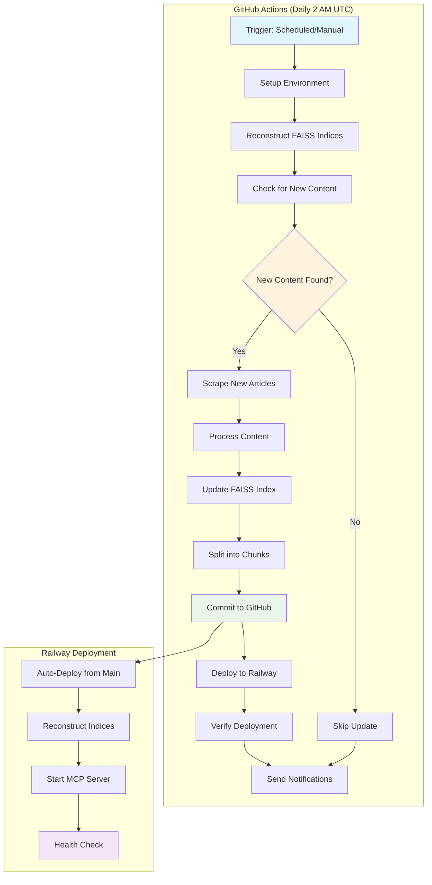

# Automated FAISS Database Updates

## Overview

This document describes the complete automated system for daily FAISS database updates, GitHub repository commits, and Railway deployments for the StrunzKnowledge project.

## System Architecture

### 🔄 Daily Automation Flow



## Workflow Configuration

### 📅 Schedule
- **Daily Execution**: 2:00 AM UTC (3:00 AM CET / 4:00 AM CEST)
- **Manual Trigger**: Available via GitHub Actions UI
- **Force Update**: Optional parameter to update regardless of new content

### 🔧 Environment Setup
```yaml
- Python 3.11
- Dependencies: requirements.txt + lxml + sentence-transformers
- Directory structure: Auto-created
- FAISS reconstruction: From chunked files
```

## Step-by-Step Process

### 1. **Content Detection**
```bash
python src/scripts/check_new_content.py
```
- Checks Dr. Strunz website for new articles
- Creates `.needs_update` flag if changes detected
- Compares with last check timestamp

### 2. **Content Scraping**
```bash
python src/scripts/update_manager.py update-news --unlimited
```
- Uses production scraper with Selenium WebDriver
- Scrapes new articles from news pages
- Handles pagination automatically
- Stores results in `data/raw/news/`

### 3. **Content Processing**
```bash
python src/rag/news_processor.py
python src/rag/forum_processor.py  # if forum data available
```
- Processes HTML content into structured data
- Extracts text, metadata, and URLs
- Chunks content for optimal vector embedding
- Stores in `data/processed/`

### 4. **FAISS Index Update**
```bash
python src/rag/update_combined_index.py
```
- Creates backup of existing indices
- Combines existing index with new content
- Generates new embeddings using sentence-transformers
- Updates combined index and metadata

### 5. **Index Chunking**
```bash
python src/scripts/data/split_faiss_index.py data/faiss_indices/combined_index.faiss
python src/scripts/data/split_faiss_index.py data/faiss_indices/combined_metadata.json
```
- Splits large files into <40MB chunks for GitHub
- Creates reconstruction scripts
- Maintains metadata for reassembly

### 6. **Repository Commit**
```bash
git add data/faiss_indices/chunks/
git add data/processed/
git add update_report.md
git commit -m "chore: update FAISS indices [skip ci]"
git push
```
- Commits only chunked files (not full indices)
- Includes update report in commit message
- Uses `[skip ci]` to prevent recursive builds

### 7. **Railway Deployment**
- **Auto-deployment**: Triggered by main branch push
- **Manual trigger**: Optional API call to Railway
- **Verification**: Health check after deployment

### 8. **Deployment Verification**
```bash
curl -f -s https://strunz.up.railway.app/
curl -s https://strunz.up.railway.app/sse
```
- Validates deployment health
- Tests MCP server functionality
- Confirms SSE endpoint availability

## Railway Integration

### 🚀 Deployment Process

#### Automatic Deployment
- **Trigger**: Git push to main branch
- **Method**: Railway monitors GitHub repository
- **Process**: Docker build → Index reconstruction → Server start

#### Docker Build Process
```dockerfile
# Copy chunked indices
COPY data/faiss_indices/chunks/ ./data/faiss_indices/chunks/

# Reconstruct full indices
RUN cd /app && bash src/scripts/data/reconstruct_indices.sh
```

#### Index Reconstruction
```bash
cd data/faiss_indices/chunks
python reconstruct_combined_index.faiss.py
python reconstruct_combined_metadata.json.py
```

### 📊 Production Endpoints
- **Health Check**: `https://strunz.up.railway.app/`
- **SSE Endpoint**: `https://strunz.up.railway.app/sse`
- **OAuth Discovery**: `https://strunz.up.railway.app/.well-known/oauth-authorization-server`

## Configuration Requirements

### 🔐 GitHub Secrets
```bash
# Optional: For manual Railway deployment
RAILWAY_TOKEN          # Railway API token
RAILWAY_PROJECT_ID     # Railway project ID
RAILWAY_ENVIRONMENT_ID # Railway environment ID
RAILWAY_SERVICE_ID     # Railway service ID

# Optional: For notifications
SLACK_WEBHOOK_URL      # Slack webhook for notifications
```

### 🗂️ Repository Structure
```
data/
├── faiss_indices/
│   └── chunks/              # Chunked indices for GitHub
│       ├── combined_index.faiss.part000
│       ├── combined_index.faiss.part001
│       ├── combined_metadata.json.part000
│       ├── combined_metadata.json.part001
│       └── reconstruct_*.py
├── processed/               # Processed content
└── raw/                    # Raw scraped content
```

## Monitoring & Notifications

### 📱 Slack Integration
- **Success notifications**: Update completion status
- **Failure alerts**: Error details and logs
- **Deployment status**: Health check results

### 📈 Metrics Tracked
- **Content updates**: Number of new articles
- **Index size**: Growth tracking
- **Deployment time**: Performance monitoring
- **Success rate**: Reliability metrics

## Error Handling

### 🔧 Failure Recovery
1. **Scraping failures**: Retry with exponential backoff
2. **Index corruption**: Automatic backup restoration
3. **Deployment failures**: Rollback to previous version
4. **Network issues**: Timeout and retry logic

### 🚨 Alert Conditions
- **Scraping errors**: Missing lxml, WebDriver crashes
- **Index errors**: Corruption, size limits
- **Deployment failures**: Railway API errors
- **Health check failures**: Server not responding

## Manual Operations

### 🔄 Manual Trigger
1. Go to GitHub Actions
2. Select "Update Knowledge Base Index" workflow
3. Click "Run workflow"
4. Optional: Check "Force update all indices"

### 🛠️ Local Testing
```bash
# Test content detection
python src/scripts/check_new_content.py

# Test scraping
python src/scripts/update_manager.py update-news

# Test index update
python src/rag/update_combined_index.py

# Test chunking
python src/scripts/data/split_faiss_index.py data/faiss_indices/combined_index.faiss
```

### 🔍 Debugging
```bash
# Check workflow logs
gh run list --workflow=update-index.yml

# View specific run
gh run view [RUN_ID]

# Check Railway logs
railway logs

# Test deployment
curl -I https://strunz.up.railway.app/
```

## Performance Optimization

### ⚡ Speed Improvements
- **Incremental updates**: Only process new content
- **Parallel processing**: Multiple scrapers
- **Caching**: Reuse embeddings when possible
- **Chunking**: Efficient storage and transfer

### 💾 Storage Management
- **Index chunking**: <40MB per file for GitHub
- **Cleanup job**: Removes old indices automatically
- **Compression**: Optimized file sizes
- **Backup retention**: Configurable history

## Security Considerations

### 🔒 Access Control
- **GitHub tokens**: Minimal required permissions
- **Railway API**: Scoped to specific project
- **Secrets management**: Encrypted storage
- **Network access**: HTTPS only

### 🛡️ Data Protection
- **No sensitive data**: In public repository
- **Encrypted secrets**: For API tokens
- **Audit logs**: All actions tracked
- **Backup security**: Encrypted storage

## Maintenance

### 📅 Regular Tasks
- **Weekly**: Review automation logs
- **Monthly**: Optimize index performance
- **Quarterly**: Update dependencies
- **Annually**: Security audit

### 🔄 Updates
- **Script updates**: Version controlled
- **Dependency updates**: Automated via Dependabot
- **Workflow updates**: Peer reviewed
- **Documentation**: Kept current

## Troubleshooting

### ❓ Common Issues

#### Content Detection Fails
```bash
# Check website accessibility
curl -I https://www.strunz.com/news/

# Verify content checker
python src/scripts/check_new_content.py
```

#### Scraping Errors
```bash
# Install missing dependencies
pip install lxml selenium

# Check WebDriver
python -c "from selenium import webdriver; print('WebDriver OK')"
```

#### Index Update Fails
```bash
# Verify FAISS installation
python -c "import faiss; print('FAISS OK')"

# Check embeddings model
python -c "from sentence_transformers import SentenceTransformer; print('Transformers OK')"
```

#### Deployment Issues
```bash
# Check Railway status
railway status

# Verify health endpoint
curl https://strunz.up.railway.app/

# Check server logs
railway logs --tail
```

## Future Enhancements

### 🚀 Planned Features
1. **Real-time updates**: WebSocket notifications
2. **Advanced monitoring**: Performance metrics
3. **A/B testing**: Index optimization
4. **Multi-language**: Extended language support
5. **API versioning**: Backward compatibility

### 📈 Scalability
- **Distributed processing**: Multiple workers
- **Database sharding**: Large-scale indices
- **CDN integration**: Global content delivery
- **Load balancing**: High availability

---

*Last updated: July 17, 2025*  
*Next review: August 17, 2025*