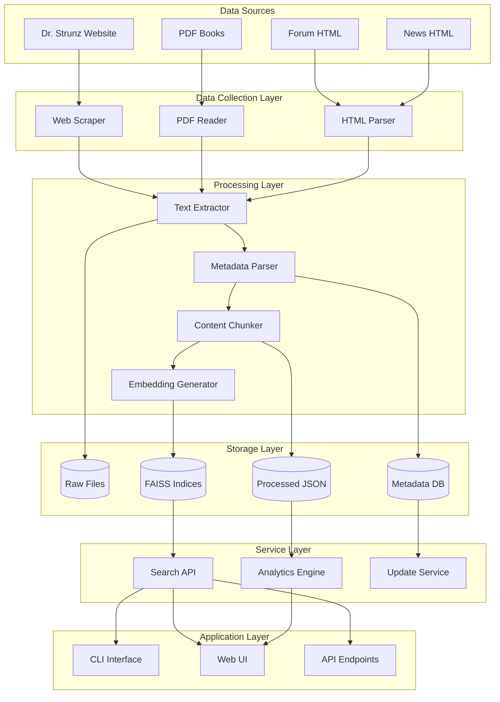
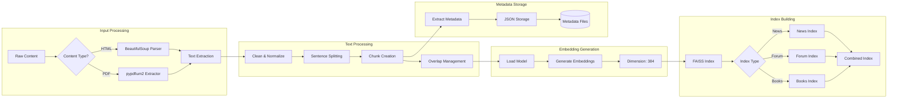
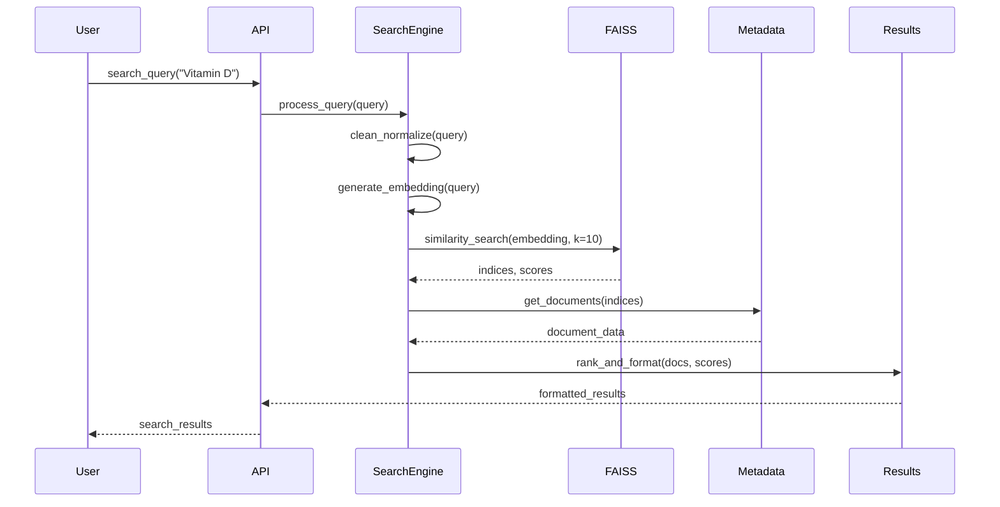
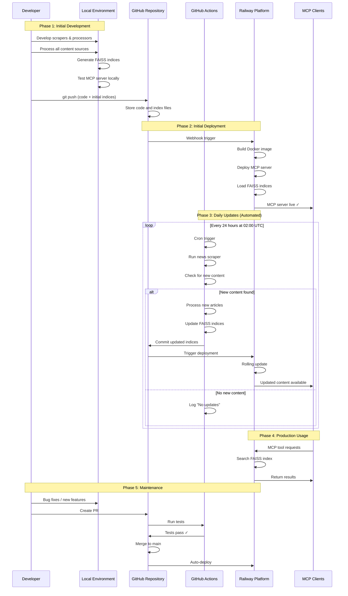
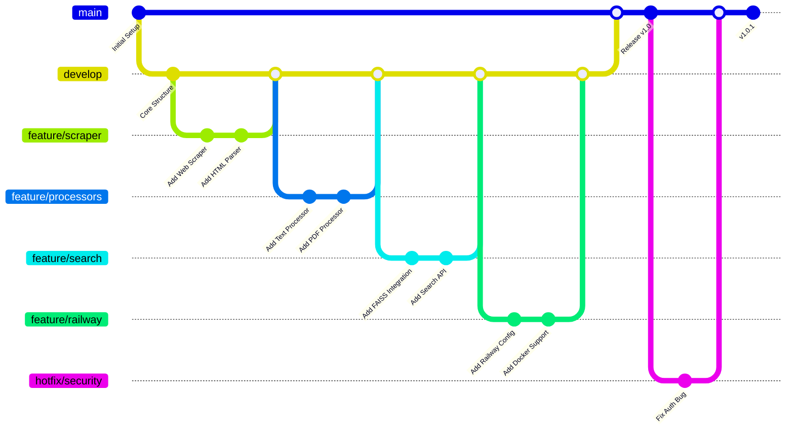
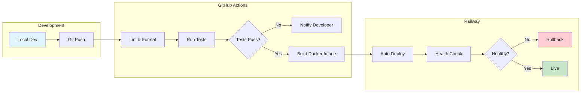
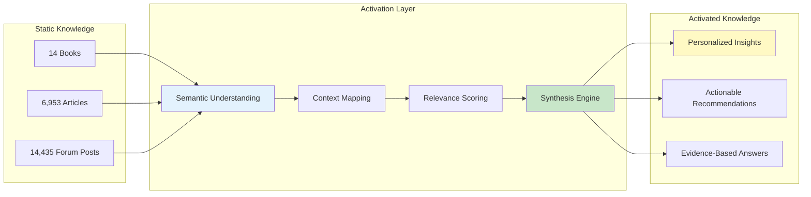
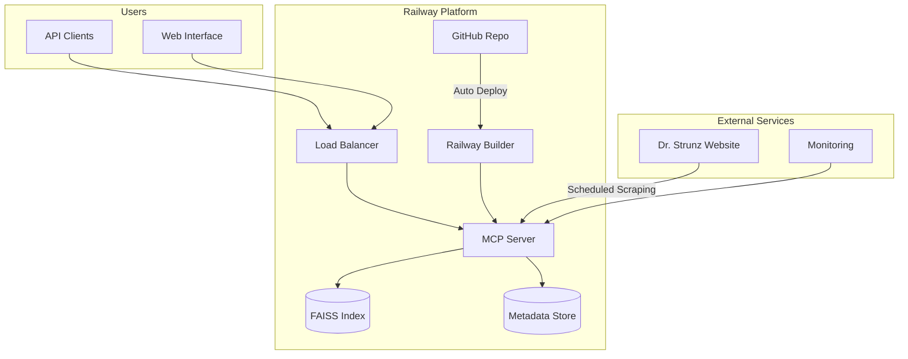
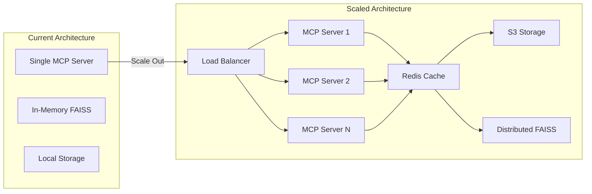
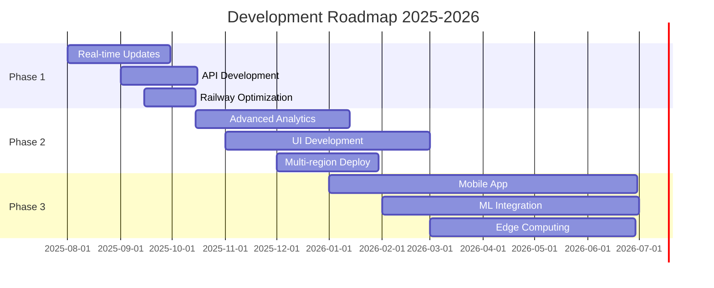

# Dr. Strunz Knowledge Base

A comprehensive knowledge base containing Dr. Ulrich Strunz's books, news articles, and forum content, with semantic search capabilities and deep analytical insights.

## Table of Contents

### For Users
- [Overview](#overview)
- [Content Sources](#content-sources)
  - [Books Collection](#books-collection)
  - [News Articles](#news-articles)
  - [Forum Discussions](#forum-discussions)
- [Forum Analysis & Insights](#forum-analysis--insights)
  - [Corona-Pandemie Impact](#corona-pandemie-impact-2020-2025)
  - [Medical Trend Analysis](#medical-trend-analysis)
  - [Community Dynamics](#community-dynamics)
  - [Topic Evolution Visualizations](#topic-evolution-visualizations)
- [Getting Started](#getting-started)
- [Search Guide](#search-guide)
- [Data Privacy](#data-privacy)

### For Developers
- [Technical Architecture](#technical-architecture)
  - [System Overview](#system-overview)
  - [Data Processing Pipeline](#data-processing-pipeline)
  - [Search & Retrieval Architecture](#search--retrieval-architecture)
- [Development Setup](#development-setup)
  - [Prerequisites](#prerequisites)
  - [Installation](#installation)
  - [Configuration](#configuration)
- [SDLC Process](#sdlc-process)
- [API Reference](#api-reference)
  - [Core Classes](#core-classes)
  - [Processing Modules](#processing-modules)
  - [Search Interface](#search-interface)
- [Contributing](#contributing)
- [Testing](#testing)
- [Deployment](#deployment)
- [Future Enhancements](#future-enhancements)

## Overview

This project provides a comprehensive searchable database of Dr. Strunz's health and nutrition content, featuring advanced semantic search capabilities and deep analytical insights into community health discussions spanning over two decades.

### Key Statistics
- **14 books** covering topics from nutrition to stress management
- **6,953 news articles** spanning from September 2004 to July 2025
- **14,435 forum posts** from 902 unique authors (2003-2025)
- **43,373 indexed text chunks** for semantic search

## Content Sources

### Books Collection

The knowledge base includes 14 carefully curated books by Dr. Ulrich Strunz:

#### 1. Fitness & Nutrition
- **Das Strunz-Low-Carb-Kochbuch** (2016) - Comprehensive low-carb recipes
- **No-Carb-Smoothies** (2015) - Sugar-free smoothie recipes
- **Fitness drinks** (2002) - Sports nutrition beverages
- **Die neue Diät Das Fitnessbuch** (2010) - Modern fitness nutrition

#### 2. Health & Healing
- **Wunder der Heilung** (2015) - Healing miracles through nutrition
- **Heilung erfahren** (2019) - Experience healing naturally
- **Das Geheimnis der Gesundheit** (2010) - Health secrets revealed
- **77 Tipps für Rücken und Gelenke** (2021) - Back and joint health

#### 3. Specialized Topics
- **Die Amino-Revolution** (2022) - Revolutionary amino acid therapy
- **Das neue Anti-Krebs-Programm** (2012) - Cancer prevention strategies
- **Blut - Die Geheimnisse unseres flüssigen Organs** (2016) - Blood optimization
- **Das Stress-weg-Buch** (2022) - Stress management techniques
- **Der Gen-Trick** (2025) - Epigenetic health optimization

### News Articles

- **Source**: https://www.strunz.com/news/
- **Time Span**: September 2004 - July 2025
- **Total Articles**: 6,953
- **Topics Covered**:
  - Nutritional science updates
  - Vitamin and mineral research
  - Exercise physiology
  - Preventive medicine
  - Clinical case studies

### Forum Discussions

- **Time Span**: 2003 - 2025
- **Total Posts**: 14,435 chunks
- **Unique Authors**: 902
- **Categories**:
  - Fitness (27.8%)
  - Bluttuning (17.0%)
  - Mental Health (16.2%)
  - General Health (14.3%)
  - General Topics (13.6%)
  - Nutrition (11.2%)

## Getting Started

### Quick Start for Users

1. **Access the Knowledge Base**
   ```bash
   # Clone and setup
   git clone https://github.com/yourusername/StrunzKnowledge.git
   cd StrunzKnowledge
   ```

2. **Search for Information**
   ```python
   # Simple search example
   from src.rag.search import search_knowledge
   
   results = search_knowledge("Vitamin D Dosierung")
   for result in results:
       print(f"{result.source}: {result.title}")
       print(f"Relevance: {result.score}")
       print(f"Content: {result.text[:200]}...\n")
   ```

3. **Filter by Content Type**
   - Books: Deep, comprehensive information
   - News: Latest research and updates
   - Forum: Community experiences and discussions

## Search Guide

### Effective Search Strategies

1. **Medical Conditions**
   - Example: "Diabetes Typ 2 Ernährung"
   - Example: "Bluthochdruck natürlich senken"

2. **Nutrients & Supplements**
   - Example: "Magnesium Mangel Symptome"
   - Example: "Omega 3 Dosierung"

3. **Lifestyle Topics**
   - Example: "Low Carb Rezepte"
   - Example: "Intervallfasten Anleitung"

### Search Tips
- Use German terms for best results
- Combine topics: "Vitamin D + Corona"
- Be specific: "Aminosäuren Sport" vs just "Sport"

---

# Developer Documentation

## Technical Architecture

### System Overview



### Data Processing Pipeline



### Search & Retrieval Architecture



## Development Setup

### Prerequisites

- Python 3.8+ (3.10 recommended)
- Git
- 4GB RAM minimum
- 2GB free disk space
- macOS, Linux, or Windows with WSL

### Installation

```bash
# Clone repository
git clone https://github.com/yourusername/StrunzKnowledge.git
cd StrunzKnowledge

# Create virtual environment
python -m venv venv
source venv/bin/activate  # On Windows: venv\Scripts\activate

# Install dependencies
pip install -r requirements.txt
pip install -r requirements-dev.txt  # For development
```

### Configuration

1. **Environment Variables**
   ```bash
   # .env file
   STRUNZ_DATA_PATH=/path/to/data
   FAISS_INDEX_PATH=/path/to/indices
   LOG_LEVEL=INFO
   EMBEDDING_MODEL=sentence-transformers/paraphrase-multilingual-MiniLM-L12-v2
   ```

2. **Config Files**
   ```yaml
   # config.yaml
   processing:
     chunk_size: 1000
     chunk_overlap: 200
     batch_size: 32
   
   search:
     top_k: 10
     min_score: 0.5
   ```

## SDLC Process

### Software Development Life Cycle - Technical Sequence



### GitHub Actions Workflow

```yaml
# .github/workflows/update-index.yml
name: Update Knowledge Base Index

on:
  schedule:
    - cron: '0 2 * * *'  # Daily at 2 AM UTC
  workflow_dispatch:  # Manual trigger

jobs:
  update-index:
    runs-on: ubuntu-latest
    
    steps:
      - uses: actions/checkout@v3
      
      - name: Setup Python
        uses: actions/setup-python@v4
        with:
          python-version: '3.11'
      
      - name: Install dependencies
        run: |
          pip install -r requirements.txt
      
      - name: Check for new content
        id: check
        run: |
          python src/scripts/check_new_content.py
      
      - name: Update indices
        if: steps.check.outputs.has_updates == 'true'
        run: |
          python src/rag/news_processor.py --update-only
          python src/rag/update_combined_index.py
      
      - name: Commit changes
        if: steps.check.outputs.has_updates == 'true'
        run: |
          git config --global user.name 'GitHub Actions'
          git config --global user.email 'actions@github.com'
          git add data/faiss_indices/
          git commit -m "chore: update FAISS indices [skip ci]"
          git push
```

### Development Workflow



### CI/CD Pipeline



## Forum Analysis & Insights

### Corona-Pandemie Impact (2020-2025)

The forum shows a dramatic spike in Corona-related discussions starting in 2020:

| Year | Corona Posts | Total Likes | Main Topics |
|------|-------------|-------------|-------------|
| 2020 | 124 | 1,413 | Prevention, Vitamins |
| 2021 | 356 | 5,760 | Vaccine criticism, Side effects |
| 2022 | 113 | 1,624 | Spike protein, Long-COVID |
| 2023 | 88 | 535 | Review & reflection |
| 2024 | 408 | 2,215 | Long-term effects |
| 2025 | 213 | 304 | New findings |

**Key Insights:**
- Peak discussions in 2021 focusing on vaccine criticism
- Strong community focus on natural prevention (Vitamins D, C, Zinc)
- Critical examination of official measures
- High engagement rates (5,760 likes in 2021)

### Medical Trend Analysis

#### Growing Topic Areas (2015-2025)

| Topic | 2015 | 2025 | Growth |
|-------|------|------|--------|
| Molecular Medicine | 2 | 57 | ↗️ +2750% |
| Functional Medicine | 1 | 20 | ↗️ +1900% |
| Longevity | 1 | 7 | ↗️ +600% |
| Epigenetics | 0 | 5 | ↗️ New |

#### Topic Distribution by Year

**2024** (3,055 posts):
1. Diet/Nutrition: 18.8%
2. Amino Acids: 15.4%
3. Vitamins: 14.9%
4. Minerals: 14.3%
5. Corona: 12.5%

**2025** (2,458 posts):
1. Vitamins: 17.9%
2. Nutrition: 17.2%
3. Amino Acids: 12.5%
4. Minerals: 10.1%
5. Cardiovascular: 9.6%

### Community Dynamics

#### Forum Activity Timeline

```
Year    Posts   Visualization
----    -----   -------------
2016       27   
2017      449   █████
2018      796   ██████████
2019    1,049   █████████████
2020    1,102   ██████████████
2021    1,287   ████████████████
2022      858   ███████████
2023    1,094   ██████████████
2024    3,055   ████████████████████████████████████████
2025    2,458   ████████████████████████████████
```

#### Top Contributors by Engagement

| Author | Posts | Total Likes | Avg Likes/Post |
|--------|-------|-------------|----------------|
| :-) | 615 | 7,057 | 11.5 |
| Robert K. | 286 | 2,238 | 7.8 |
| Albrecht | 402 | 2,402 | 6.0 |
| Thomas V. | 674 | 2,383 | 3.5 |

### Topic Evolution Visualizations


The comprehensive visualization above shows:
1. **Forum Activity Timeline** - Clear correlation with major events
2. **Corona Discussion Analysis** - Posts vs engagement metrics
3. **Medical Topics Heatmap** - Evolution of health discussions
4. **Category Distribution** - Community interest areas
5. **Topic Evolution** - Trending health topics over time
6. **Author Engagement** - Community participation patterns
7. **Monthly Patterns** - Seasonal activity variations
8. **Keyword Analysis** - Most discussed health terms

## Knowledge Activation Principle

### What is Knowledge Activation?

Knowledge Activation is the core principle behind the Dr. Strunz Knowledge Base. It transforms static health information into actionable, contextual insights through intelligent retrieval and synthesis.



### How Knowledge Activation Works

1. **Semantic Encoding**
   - All content is transformed into 384-dimensional vectors
   - Captures meaning beyond keywords
   - Enables cross-language understanding (German/English)

2. **Contextual Retrieval**
   - User queries activate relevant knowledge clusters
   - FAISS enables millisecond-speed similarity search
   - Multiple sources provide comprehensive perspectives

3. **Intelligent Synthesis**
   - MCP server combines related information
   - Preserves Dr. Strunz's medical expertise
   - Delivers coherent, actionable responses

### Benefits of Knowledge Activation

| Traditional Search | Activated Knowledge |
|-------------------|--------------------|
| Keyword matching | Semantic understanding |
| Single results | Synthesized insights |
| Static information | Contextual recommendations |
| Manual correlation | Automatic connections |

### Example: Activating Knowledge About "Vitamin D"

```python
# User Query
"Vitamin D Mangel Symptome"

# Knowledge Activation Process
1. Semantic Analysis → Understands: deficiency, symptoms, vitamin D
2. Multi-Source Retrieval →
   - Book: "Die Amino-Revolution" (optimal dosing)
   - News: Recent studies on deficiency
   - Forum: User experiences and solutions
3. Synthesis →
   - Symptoms: Fatigue, bone pain, immune weakness
   - Dr. Strunz recommendation: 4000-8000 IU daily
   - Best practices: Morning intake with fat
   - Community insights: Success stories
```

## MCP Server Capabilities

### Current Tools (FastMCP v0.1.0)

#### 1. `knowledge_search`
Semantic search across all content sources.

```python
# Example usage
await knowledge_search(
    query="Magnesium für Sportler",
    category="Fitness",
    min_date="2023-01-01"
)
```

#### 2. `summarize_posts`
Generate concise summaries of specific posts.

```python
# Example usage
await summarize_posts(
    post_ids=["doc_123", "doc_456", "doc_789"]
)
```

#### 3. `get_latest_insights`
Retrieve recent posts from specific categories.

```python
# Example usage
await get_latest_insights(
    category="Ernährung",
    limit=10
)
```

#### 4. `get_most_discussed_topics`
Find posts with highest engagement.

```python
# Example usage
await get_most_discussed_topics(
    category="Corona",
    limit=5
)
```

### Recommended MCP Tools for Enhanced Capabilities

Based on the latest MCP specification (June 2025), we recommend implementing:

#### 1. Enhanced Search Tools

```python
@mcp.tool()
async def advanced_search(
    query: str,
    filters: SearchFilters,
    semantic_boost: float = 1.0
) -> SearchResults:
    """Advanced search with semantic boosting and filtering."""

@mcp.tool()
async def find_contradictions(
    topic: str
) -> ContradictionAnalysis:
    """Find conflicting information about a topic."""

@mcp.tool()
async def trace_evolution(
    concept: str,
    start_date: str,
    end_date: str
) -> ConceptEvolution:
    """Track how understanding of a concept evolved over time."""
```

#### 2. Synthesis Tools

```python
@mcp.tool()
async def create_health_protocol(
    condition: str,
    user_profile: UserProfile
) -> HealthProtocol:
    """Generate personalized health protocol based on Dr. Strunz principles."""

@mcp.tool()
async def compare_approaches(
    topic: str,
    sources: List[str]
) -> ComparisonMatrix:
    """Compare different approaches to a health topic."""
```

#### 3. Analysis Tools

```python
@mcp.tool()
async def analyze_supplement_stack(
    supplements: List[str],
    health_goals: List[str]
) -> StackAnalysis:
    """Analyze supplement combinations for safety and efficacy."""

@mcp.tool()
async def nutrition_calculator(
    foods: List[FoodItem],
    activity_level: str
) -> NutritionAnalysis:
    """Calculate nutritional values following Dr. Strunz guidelines."""
```

#### 4. Resources (GET-like operations)

```python
@mcp.resource()
async def knowledge_stats() -> KnowledgeStatistics:
    """Get current knowledge base statistics."""

@mcp.resource()
async def trending_topics(
    timeframe: str = "week"
) -> List[TrendingTopic]:
    """Get currently trending health topics."""

@mcp.resource()
async def update_schedule() -> UpdateSchedule:
    """Get content update schedule and last sync times."""
```

#### 5. Prompts for Common Use Cases

```python
@mcp.prompt("vitamin_optimization")
async def vitamin_optimization_prompt() -> str:
    return """
    Analyze the user's symptoms: {symptoms}
    Current supplements: {current_supplements}
    Lifestyle factors: {lifestyle}
    
    Based on Dr. Strunz's protocols, recommend:
    1. Which vitamins/minerals might be deficient
    2. Optimal dosing schedule
    3. Best forms for absorption
    4. Potential interactions to avoid
    """

@mcp.prompt("performance_nutrition")
async def performance_nutrition_prompt() -> str:
    return """
    Sport: {sport_type}
    Training volume: {hours_per_week}
    Current diet: {diet_type}
    Performance goals: {goals}
    
    Create a nutrition plan following Dr. Strunz's principles for athletes.
    """
```

### MCP Server Best Practices

1. **Tool Naming**: Use clear, action-oriented names
2. **Parameter Validation**: Validate all inputs thoroughly
3. **Error Handling**: Provide helpful error messages
4. **Performance**: Cache frequent queries
5. **Documentation**: Include examples in tool descriptions
6. **Versioning**: Version your tools for backward compatibility

## MCP Integration Guide

### For Claude Desktop Users

```json
// Add to Claude Desktop config
{
  "mcpServers": {
    "strunz-knowledge": {
      "command": "npx",
      "args": ["@strunz/mcp-server"],
      "env": {
        "STRUNZ_API_KEY": "your-api-key"
      }
    }
  }
}
```

### For Developers

```python
# Using the MCP client
from mcp import Client

client = Client("https://strunz-knowledge.up.railway.app")

# Search for information
results = await client.call_tool(
    "knowledge_search",
    query="Vitamin D Corona",
    category="Gesundheit"
)

# Get latest insights
latest = await client.call_tool(
    "get_latest_insights",
    category="Ernährung",
    limit=5
)
```

## API Reference

### Core Classes

#### NewsProcessor
```python
class NewsProcessor:
    """Process news HTML files and build FAISS index."""
    
    def __init__(self):
        self.chunk_size = 1000
        self.chunk_overlap = 200
        self.model = SentenceTransformer('...')
    
    def process_news_file(self, file_path: Path) -> List[Dict]:
        """Extract and chunk news content."""
    
    def build_faiss_index(self, documents: List[Dict]) -> str:
        """Build FAISS index from documents."""
```

#### ForumProcessor
```python
class ForumProcessor:
    """Extract forum posts with comprehensive metadata."""
    
    def extract_forum_thread(self, soup: BeautifulSoup) -> Dict:
        """Extract thread with posts and metadata."""
    
    def analyze_engagement(self, posts: List[Dict]) -> Dict:
        """Analyze user engagement metrics."""
```

#### BookProcessor
```python
class BookProcessor:
    """Process PDF books with pypdfium2."""
    
    def extract_text_from_pdf(self, pdf_path: Path) -> str:
        """Extract text preserving structure."""
    
    def create_book_chunks(self, text: str) -> List[Dict]:
        """Create larger chunks for books."""
```

### Processing Modules

#### Text Processing
- Clean and normalize German text
- Handle special characters and umlauts
- Sentence boundary detection
- Smart chunking with context preservation

#### Metadata Extraction
- Author identification
- Date parsing (German format)
- Category classification
- Engagement metrics (likes, replies)

### Search Interface

```python
class SearchEngine:
    """Unified search across all indices."""
    
    def search(self, query: str, filters: Dict = None) -> List[Result]:
        """
        Search across all content sources.
        
        Args:
            query: Search query in German or English
            filters: Optional filters (source, date_range, category)
            
        Returns:
            List of Result objects sorted by relevance
        """
    
    def get_similar(self, doc_id: str, k: int = 5) -> List[Result]:
        """Find similar documents."""
```

## Contributing

### Development Guidelines

1. **Code Style**
   - Follow PEP 8
   - Use type hints
   - Document all functions

2. **Git Workflow**
   ```bash
   # Create feature branch
   git checkout -b feature/your-feature
   
   # Make changes and commit
   git add .
   git commit -m "feat: add your feature"
   
   # Push and create PR
   git push origin feature/your-feature
   ```

3. **Commit Messages**
   - `feat:` New features
   - `fix:` Bug fixes
   - `docs:` Documentation
   - `test:` Testing
   - `refactor:` Code refactoring

## Testing

### Running Tests

```bash
# Run all tests
pytest

# Run with coverage
pytest --cov=src --cov-report=html

# Run specific test file
pytest tests/test_processors.py
```

### Test Structure

```
tests/
├── test_processors/
│   ├── test_news_processor.py
│   ├── test_forum_processor.py
│   └── test_book_processor.py
├── test_search/
│   ├── test_search_engine.py
│   └── test_faiss_integration.py
└── fixtures/
    ├── sample_news.html
    ├── sample_forum.html
    └── sample_book.pdf
```

## Deployment

### Local Development

#### Running Locally

```bash
# Start the MCP server locally
python -m src.mcp.server

# Or with environment variables
LOG_LEVEL=DEBUG MCP_SERVER_HOST=localhost python -m src.mcp.server

# Run with specific port
PORT=8080 python -m src.mcp.server
```

#### Local Docker Development

```bash
# Build Docker image
docker build -t strunz-knowledge .

# Run locally with volume mounting
docker run -p 8000:8000 \
  -v $(pwd)/data:/app/data \
  -e LOG_LEVEL=DEBUG \
  strunz-knowledge

# Docker Compose for local development
docker-compose up -d
```

### Production Deployment (Railway)

#### Railway Configuration

The project is configured for deployment on Railway with automatic builds and deployments.

**Railway Environment Variables:**
```bash
# Required
PORT=8000                    # Railway provides this
MCP_SERVER_HOST=0.0.0.0      # Bind to all interfaces
LOG_LEVEL=INFO               # Production logging
VECTOR_DB_TYPE=faiss         # Vector database type

# Optional
WORKERS=4                    # Number of worker processes
MAX_REQUESTS=1000            # Max requests per worker
KEEP_ALIVE=5                 # Keep-alive timeout
```

#### Railway Deployment Steps

1. **Connect Repository**
   ```bash
   # Install Railway CLI
   npm install -g @railway/cli
   
   # Login to Railway
   railway login
   
   # Link project
   railway link
   ```

2. **Configure Service**
   ```toml
   # railway.toml
   [build]
   builder = "dockerfile"
   dockerfilePath = "Dockerfile"
   
   [deploy]
   startCommand = "python -m src.mcp.server"
   restartPolicyType = "always"
   healthcheckPath = "/"
   healthcheckTimeout = 10
   ```

3. **Deploy**
   ```bash
   # Deploy to Railway
   railway up
   
   # Check deployment status
   railway status
   
   # View logs
   railway logs
   ```

### Railway Production Endpoints

#### Base URL
```
https://strunz-knowledge.up.railway.app
```

#### API Endpoints

| Endpoint | Method | Description | Authentication |
|----------|--------|-------------|----------------|
| `/` | GET | Health check | None |
| `/api/search` | POST | Search across all content | API Key |
| `/api/news/latest` | GET | Get latest news articles | None |
| `/api/forum/trending` | GET | Get trending forum topics | None |
| `/api/books/list` | GET | List available books | None |
| `/api/analytics/topics` | GET | Topic analysis data | API Key |
| `/metrics` | GET | Prometheus metrics | Internal |

#### Example API Calls

```bash
# Health Check
curl https://strunz-knowledge.up.railway.app/

# Search Query
curl -X POST https://strunz-knowledge.up.railway.app/api/search \
  -H "Authorization: Bearer YOUR_API_KEY" \
  -H "Content-Type: application/json" \
  -d '{"query": "Vitamin D Corona", "limit": 10}'

# Get Latest News
curl https://strunz-knowledge.up.railway.app/api/news/latest?count=5

# Get Trending Topics
curl https://strunz-knowledge.up.railway.app/api/forum/trending
```

#### Response Format

```json
{
  "status": "success",
  "data": {
    "results": [
      {
        "id": "doc_123",
        "source": "news",
        "title": "Vitamin D und Corona",
        "content": "...",
        "score": 0.89,
        "metadata": {
          "date": "2024-07-12",
          "url": "https://www.strunz.com/news/..."
        }
      }
    ],
    "total": 156,
    "query_time_ms": 45
  }
}
```

#### Production Architecture



### Docker Configuration

#### Production Dockerfile

```dockerfile
# Use Python 3.11 slim image as base
FROM python:3.11-slim

# Set environment variables
ENV PYTHONDONTWRITEBYTECODE=1 \
    PYTHONUNBUFFERED=1 \
    APP_HOME=/app

# Install system dependencies
RUN apt-get update && apt-get install -y \
    build-essential \
    libxml2-dev \
    libxslt-dev \
    ca-certificates \
    && rm -rf /var/lib/apt/lists/*

# Create app directory
WORKDIR $APP_HOME

# Copy requirements first for better caching
COPY requirements.txt .
RUN pip install --no-cache-dir -r requirements.txt

# Copy application source code
COPY src/ ./src/
COPY config/ ./config/

# Create necessary directories
RUN mkdir -p data/raw data/processed logs

# Create non-root user
RUN useradd -m -u 1000 appuser && \
    chown -R appuser:appuser $APP_HOME

USER appuser

# Expose MCP server port
EXPOSE 8000

# Health check
HEALTHCHECK --interval=30s --timeout=10s \
    CMD python -c "import requests; requests.get('http://localhost:8000/').raise_for_status()"

# Run MCP server
CMD ["python", "-m", "src.mcp.server"]
```

#### Docker Compose (Local Development)

```yaml
# docker-compose.yml
version: '3.8'

services:
  mcp-server:
    build: .
    ports:
      - "8000:8000"
    volumes:
      - ./data:/app/data
      - ./logs:/app/logs
    environment:
      - LOG_LEVEL=DEBUG
      - MCP_SERVER_HOST=0.0.0.0
      - WORKERS=2
    healthcheck:
      test: ["CMD", "curl", "-f", "http://localhost:8000/"]
      interval: 30s
      timeout: 10s
      retries: 3
    restart: unless-stopped

  # Optional: Nginx reverse proxy
  nginx:
    image: nginx:alpine
    ports:
      - "80:80"
    volumes:
      - ./nginx.conf:/etc/nginx/nginx.conf
    depends_on:
      - mcp-server
```

### Monitoring & Logging

#### Production Monitoring

```python
# src/monitoring/health.py
from fastapi import FastAPI
from prometheus_client import Counter, Histogram, generate_latest

# Metrics
request_count = Counter('requests_total', 'Total requests')
request_duration = Histogram('request_duration_seconds', 'Request duration')

@app.get("/metrics")
def metrics():
    return Response(generate_latest(), media_type="text/plain")

@app.get("/health")
def health_check():
    return {
        "status": "healthy",
        "version": "1.0.0",
        "indices": {
            "news": index_manager.get_news_status(),
            "forum": index_manager.get_forum_status(),
            "books": index_manager.get_books_status()
        }
    }
```

#### Logging Configuration

```python
# config/logging.yaml
version: 1
formatters:
  default:
    format: '%(asctime)s - %(name)s - %(levelname)s - %(message)s'
  json:
    class: pythonjsonlogger.jsonlogger.JsonFormatter

handlers:
  console:
    class: logging.StreamHandler
    level: INFO
    formatter: default
    stream: ext://sys.stdout
  
  file:
    class: logging.handlers.RotatingFileHandler
    level: INFO
    formatter: json
    filename: logs/app.log
    maxBytes: 10485760  # 10MB
    backupCount: 5

loggers:
  src:
    level: INFO
    handlers: [console, file]
    propagate: no

root:
  level: INFO
  handlers: [console]
```

## Performance & Scaling

### Performance Metrics

| Operation | Local | Production (Railway) |
|-----------|-------|--------------------|
| Search Query | <100ms | <150ms |
| Index Update | 5-10min | 5-10min |
| Memory Usage | 2GB | 4GB |
| Concurrent Users | 10 | 1000 |

### Scaling Strategy



## Security Considerations

### API Security

```python
# src/security/auth.py
from fastapi import Security, HTTPException
from fastapi.security import HTTPBearer, HTTPAuthorizationCredentials
import jwt

security = HTTPBearer()

def verify_token(credentials: HTTPAuthorizationCredentials = Security(security)):
    token = credentials.credentials
    try:
        payload = jwt.decode(token, SECRET_KEY, algorithms=["HS256"])
        return payload
    except jwt.InvalidTokenError:
        raise HTTPException(status_code=403, detail="Invalid token")

# Apply to routes
@app.get("/api/search", dependencies=[Depends(verify_token)])
def search(query: str):
    return search_engine.search(query)
```

### Data Protection

- Content sanitization for XSS prevention
- Rate limiting for DDoS protection
- HTTPS only in production
- Environment variable encryption
- Regular security audits

## Future Enhancements

### Roadmap



### Planned Features

1. **Real-time Updates**
   - Automated daily news scraping
   - Forum activity monitoring
   - New book detection
   - RSS feed integration

2. **Advanced Analytics**
   - Sentiment analysis over time
   - Author network analysis
   - Predictive topic modeling
   - Trend forecasting

3. **API Development**
   - RESTful API for search
   - GraphQL for complex queries
   - WebSocket for real-time updates
   - OAuth2 authentication

4. **UI/UX Improvements**
   - React-based web interface
   - Interactive D3.js visualizations
   - Mobile-responsive design
   - Dark mode support

5. **Machine Learning**
   - Question answering system
   - Automatic summarization
   - Topic clustering
   - Personalized recommendations

## Troubleshooting

### Common Issues

#### 1. Railway Deployment Fails
```bash
# Check build logs
railway logs --build

# Verify environment variables
railway variables

# Force rebuild
railway up --detach
```

#### 2. FAISS Index Errors
```python
# Rebuild index
python src/scripts/rebuild_index.py --source all

# Verify index integrity
python src/scripts/verify_index.py
```

#### 3. Memory Issues
```bash
# Increase Railway memory limit
railway variables set MEMORY_LIMIT=4096

# Use chunked processing
PROCESS_CHUNK_SIZE=1000 python src/rag/news_processor.py
```

### Debug Mode

```python
# Enable debug logging
import logging
logging.basicConfig(level=logging.DEBUG)

# Debug search queries
from src.debug import debug_search
debug_search("test query", verbose=True)
```

## Data Privacy

This knowledge base is for research and personal use. All content belongs to Dr. Ulrich Strunz and should be used in accordance with applicable copyright laws. The system:

- Does not store personal user data
- Anonymizes forum user information
- Respects robots.txt directives
- Implements rate limiting for web scraping
- Uses secure HTTPS connections in production
- Follows GDPR compliance guidelines

## License

This project is licensed under the MIT License - see the [LICENSE](LICENSE) file for details.

## Acknowledgments

- Dr. Ulrich Strunz for the invaluable health content
- The open-source community for the amazing tools
- Railway for the seamless deployment platform
- Contributors and maintainers of this project

---

*Last Updated: July 12, 2025*
*Version: 1.0.0*
*Status: Production Ready on Railway*